# D2C-Picasso研究

## 价值

- 1、减少设计切图、走查时间
- 2、减少开发切图，静态布局时间
- 3、减少测试UI-case编写及验证时间,提升针对UI下游流程的研发效率。

## 执行阶段

  ‌‌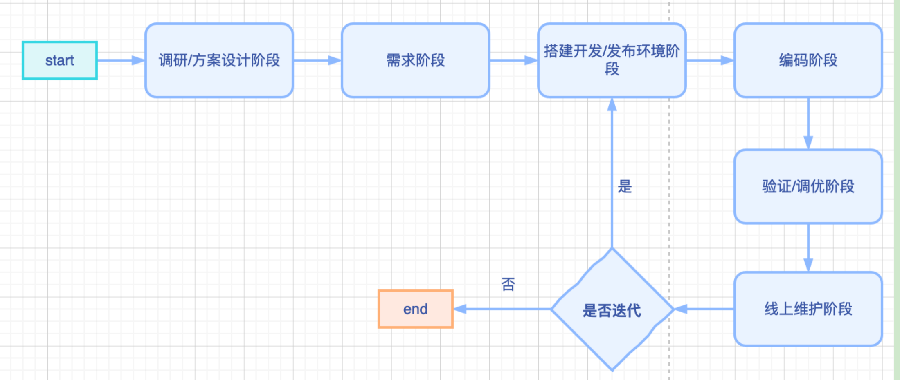

## 调研/方案阶段

- 1、调研行业内各个大厂开源的代码、文档等，参考地址：`https://cooper.didichuxing.com/knowledge/2199549234450/2199610015622`
- 2、设计自研方案，梳理研发流程及可参考的代码及文档。见下。
- 3、项目排期表
  ‌‌

## 需求阶段

基于picasso插件的执行步骤：

- 1、修改插件名称，参考开发文档，发布新插件，预估0.5天。参考文档地址：xx
- 2、搭建本地开发/调试环境，预估0.5天（mac-m1无法下载devtool，换电脑或使用其他方案）
- 3、新增导出vue/react代码能力。预估4周
- 4、项目流程图
  ‌‌‌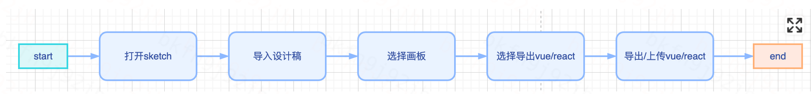

## 搭建开发/发布环境阶段

- 1、准备vscode及nodejs/npm环境（略）
- 2、下载sketch-v80及以上，下载.sketch设计稿、sketch-devtool调试插件、picasso转代码插件等
- 3、新建代码库，导入picasso，按照文档运行代码。

```sh
# 安装依赖
npm i
# 编译并关联插件
npm run postinstall
# 监听变化并实时发布
npm run watch
# 新开终端窗口，实时打印控制台log
skpm log -f
# 有条件安装sketch-devtool
# 下载地址：https://github.com/skpm/sketch-dev-tools
# Picasso源码地址：https://github.com/wuba/Picasso/

```

- 4、sketch开发者中文文档：https://developer.sketchapp.boltdoggy.com/guides/
- 5、sketch插件中心：https://www.sketch.com/extensions/plugins/

## 编码阶段

### 架构图

6个层，交互层，业务层、转换层，是我们拓展能力的重点。
‌‌‌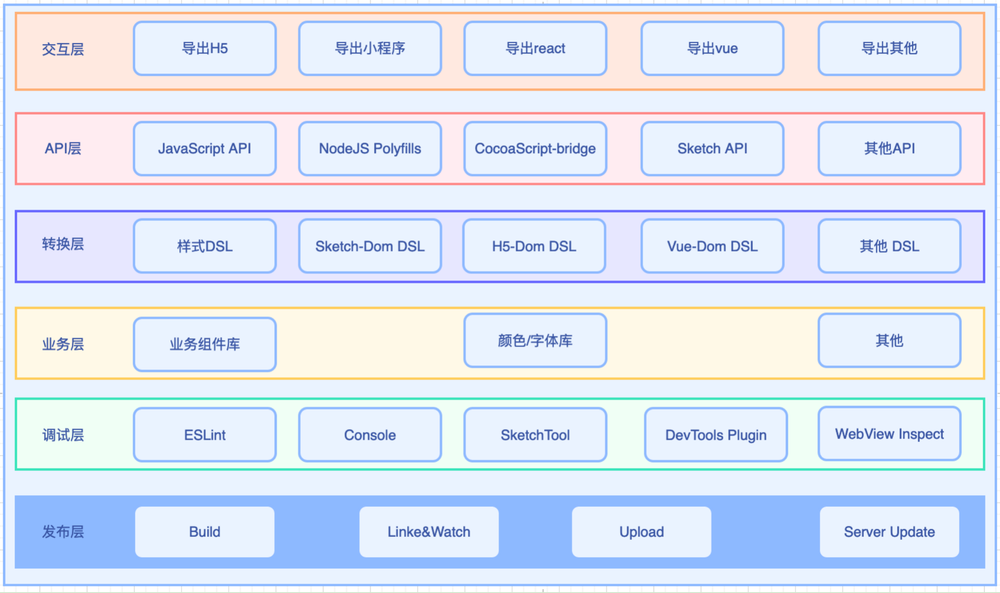

### 以vue为例。

- 1、制定技术流程方案‌‌‌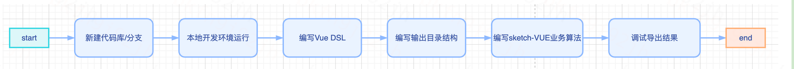
- 2、编码过程
- 3、导出并调试

## 验证调优阶段

- 1、收集各业务类型各种布局样式得sketch设计稿，从 `imgcook`平台等渠道获取
- 2、使用开发的插件导出代码并运行，验证多种类型设备运行正常情况
- 3、导出代码与设计稿效果比对，从调试工具上观察结构、层次、属性的还原情况。（核心case：dom结构、dom层次、元素核心样式及属性等）

## 线上维护阶段（收集问题，拓展能力（Android/IOS/sketch面板））

- 1、内测并收集问题，修改bug
- 2、拓展能力，如sketch面板功能升级，新增Android/IOS导出,搭建平台

## sketch结构解析

sketch-json蕴含哪些信息呢？

- 结构信息（前后左右元素组织）

- 关联信息（子父，兄弟）

- 外观信息（宽高颜色透明度边框）

- 位置信息（坐标，层级，前后左右）

- 类型信息（文本，图片，形状）

- 衍生信息：相似性， web-json 布局，节点结构，节点类型，节点顺序，节点大小，节点层级，节点外观，节点位置

- vue模板：上导入项，中布局，下样式

- 导入项：全局样式，vue框架文件

- 逻辑层：模块化结构，data、生命周期、method，

- 样式层：常用样式、样式顺序，结构。

[sketch 属性](http://www.sketchcn.com/sketch-chinese-user-manual.html#fills)

## 其他资料

1、原稿得sketch-dom结构，图为背景图元素的标签属性
‌‌‌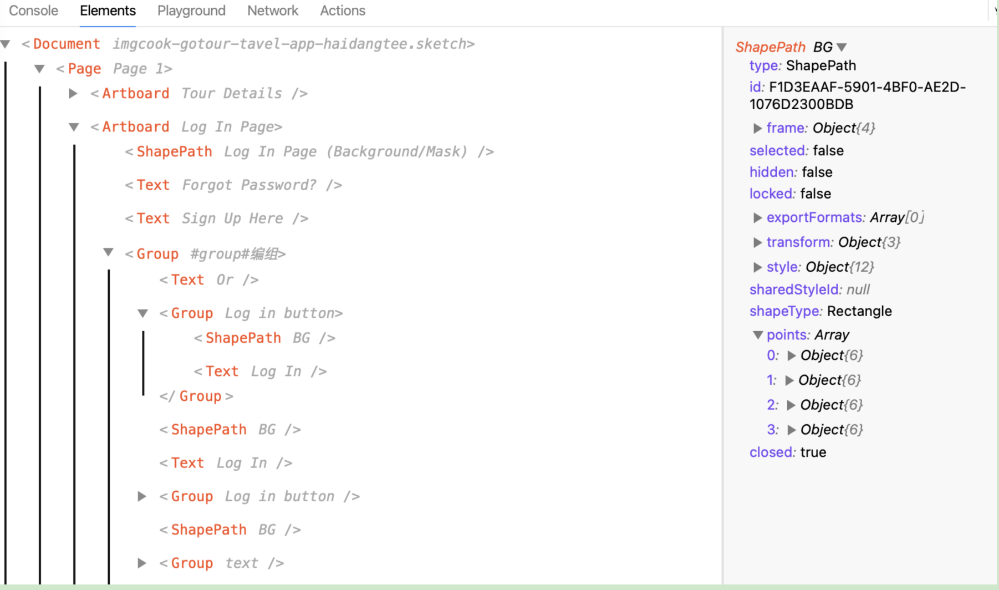

图为文本log in 元素的标签属性
‌‌‌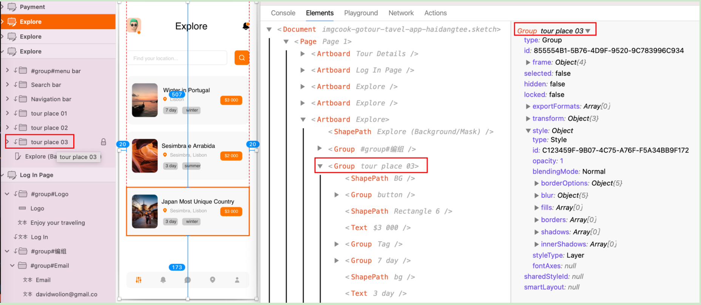

图为编组03得标签属性，
‌‌‌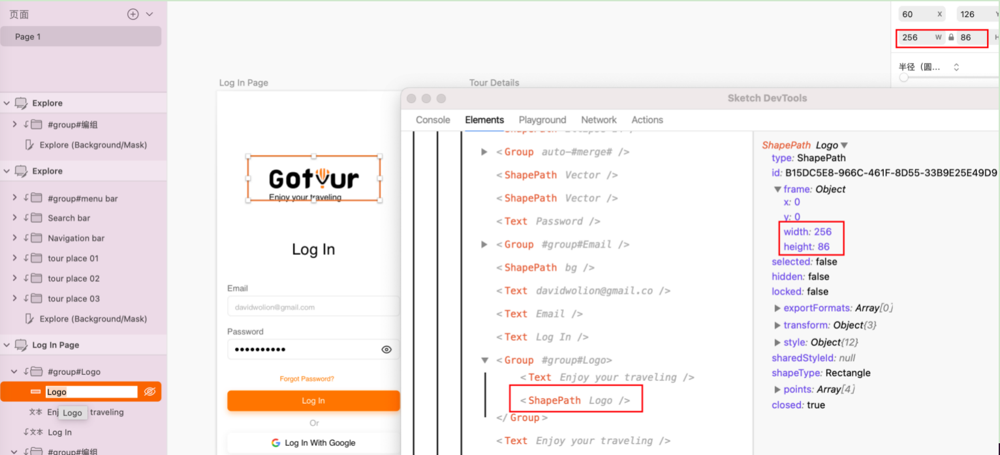

图为图片元素标签属性
‌‌‌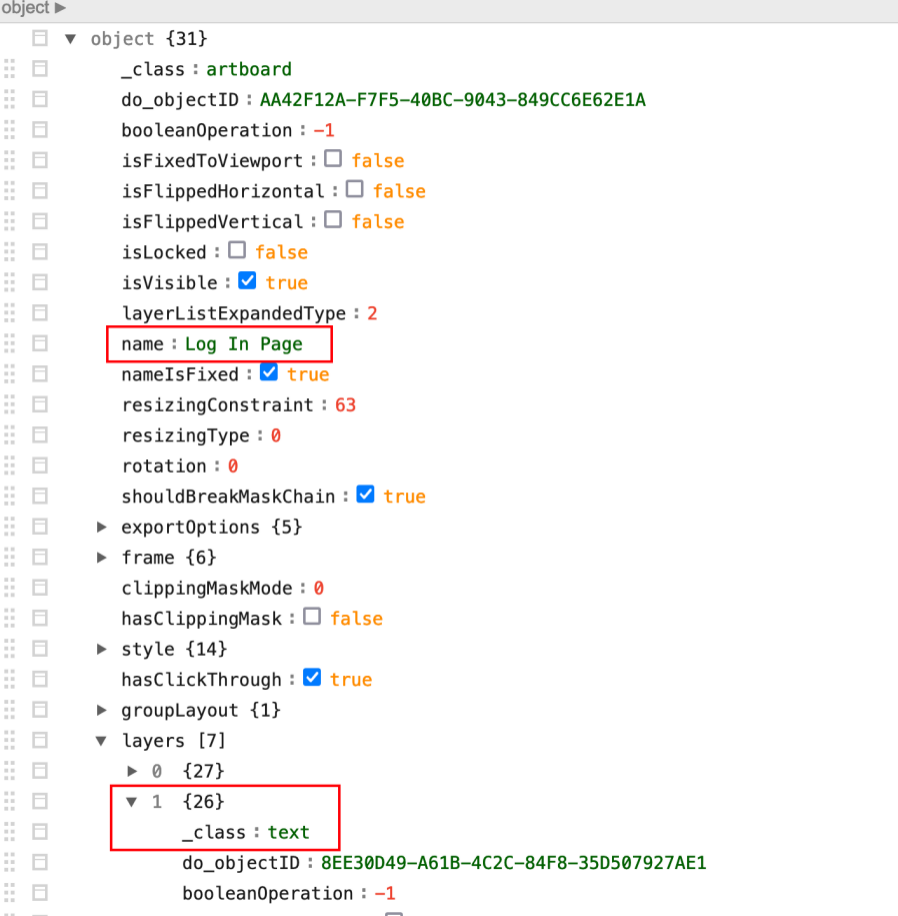

整理后得部分JSON
‌‌‌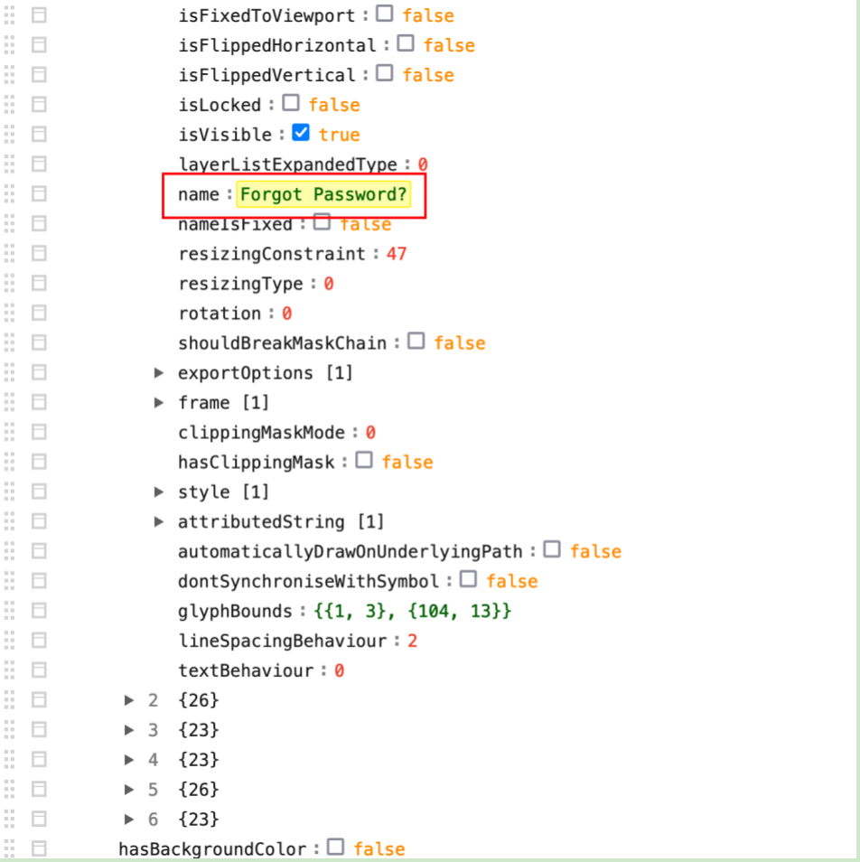

背景图元素的类型及属性
‌‌‌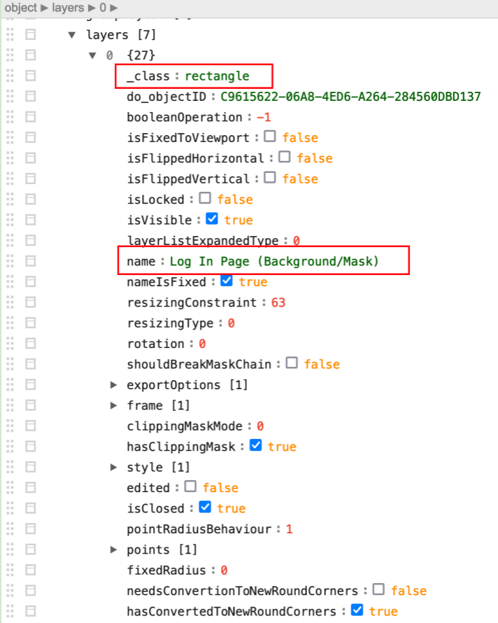

## 未来展望

- 1、以上是根据设计稿来导出适合各端得代码样例
- 2、还可以根据截图来转代码，这样就不依赖团队内得设计师了。可以把UE、其他公司的产品截图、领导的草图等等转为代码
- 3、把每个页面变成可拖拽布局的页面并发布。将我们的工程代码植入npm包，变成每个页面都可以灵活拖拽布局的页面。非常适用于mis项目。

## 参考文献

- 1、开源sketch插件：[https://github.com/wuba/Picasso](https://github.com/wuba/Picasso)
- 2、sketch开发者中文API：[https://developer.sketchapp.boltdoggy.com/guides/debugging-plugins/](https://developer.sketchapp.boltdoggy.com/guides/debugging-plugins/)
- 3、调试工具devtools：[https://github.com/skpm/sketch-dev-tools](https://github.com/skpm/sketch-dev-tools)
- 4、代码对比工具：[https://www.scootersoftware.com/download.php](https://www.scootersoftware.com/download.php)
- 5、web版和运营web版代码对比，决定定位很多
- 6、插件开发介绍

‌‌‌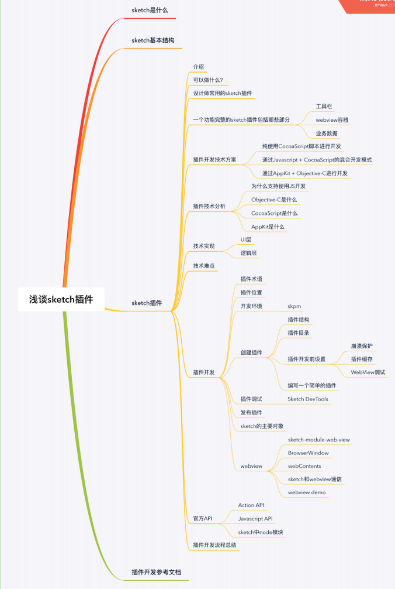

- 7、sketch中文插件库：[https://oursketch.com/plugin](https://oursketch.com/plugin)
