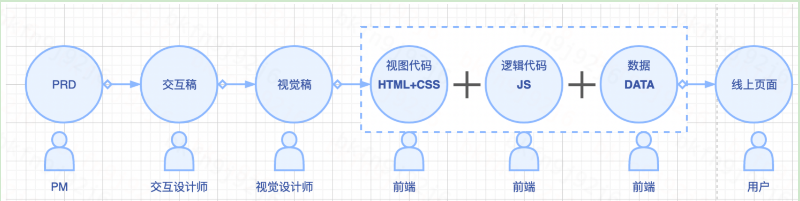
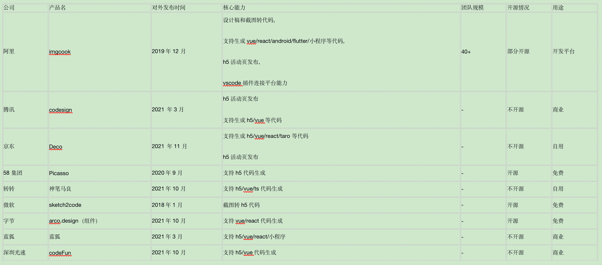
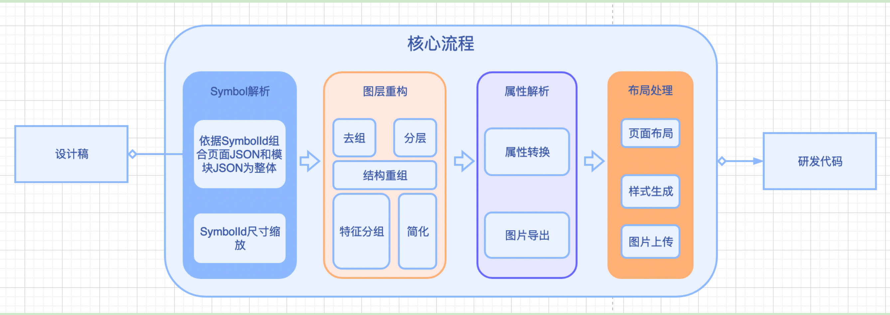
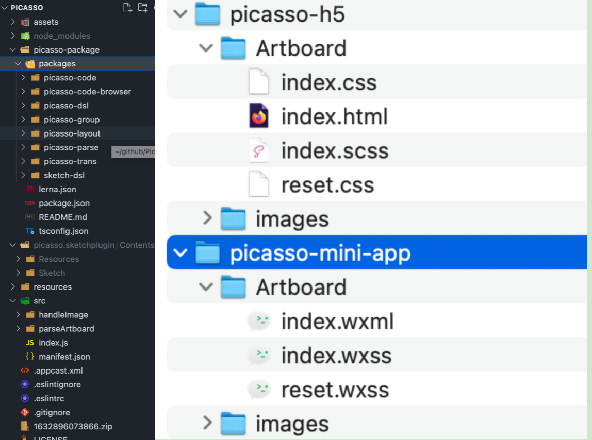
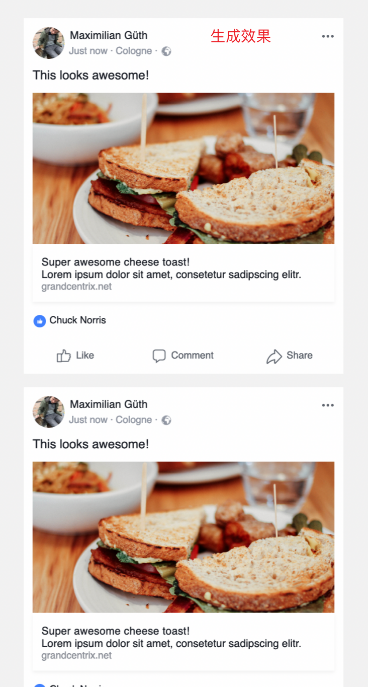
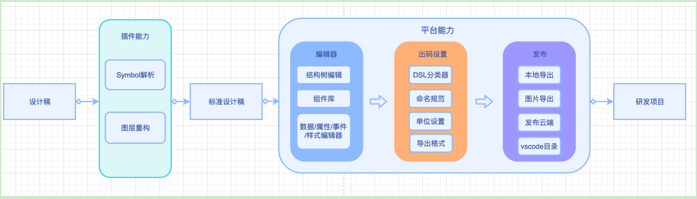
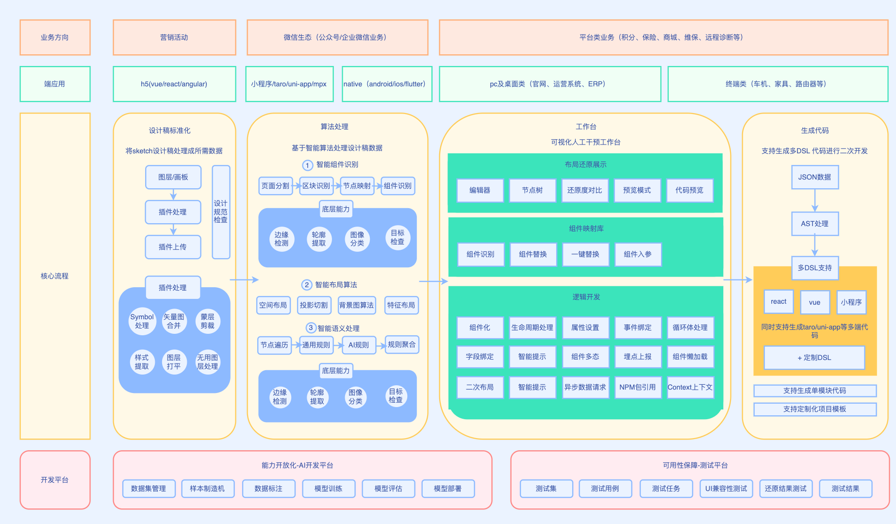
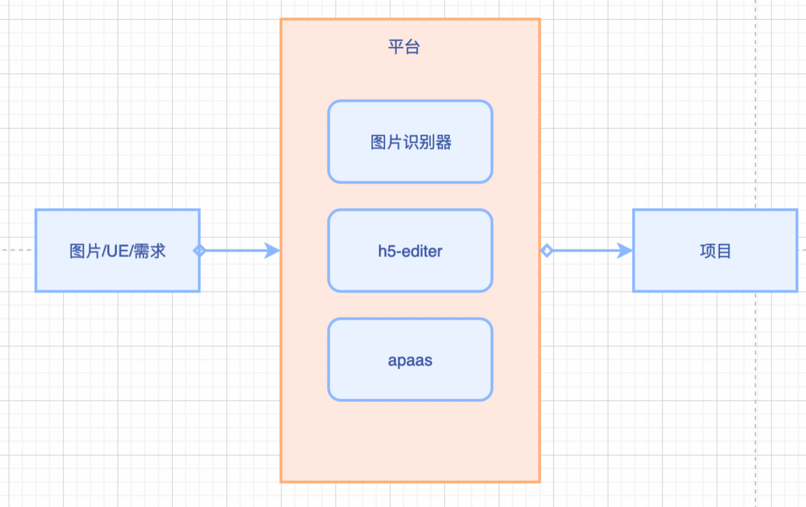

# D2C- design to code

## 目标

智能地将设计稿转代码，提升FE参与环节的工作效率.  
目前的团队痛点：c端设计稿出的慢，平台端基本不提供，都是歪歪扭扭的截图。  

## FE工作流

‌

## 行业现状

‌
行业的龙头企业都已入局。  
我们刚起步，基本的实现路径：Picasso->arco.design/Plasmic->sketch2code->imgcook  

## 一期范围

1、开发sketch插件，将设计稿转为h5静态代码，支持vue场景。
流程图
[设计稿]-[Symbol解析]-[图层重构]-[属性解析]-[布局处理+图片处理]-[研发代码]
‌‌

注：由于设计师布局思维与研发布局思维不同，核心流程是精确率得关键流程。  

### 执行步骤

1、熟悉插件开发规范，搭建插件开发环境  
2、梳理设计稿制作规范，熟悉设计稿输出格式规范Symbol解析  
3、对设计稿按照前端切图思路重组整理，输出标准JSON
4、开发h5得dsl，将标准JSON转换为h5代码  
5、开发vue的dsl，将标准json转换为vue代码

### 排期评估

6周开发，3周调优。

### 人力评估

探路阶段，打个样。能够梳理清楚细节流程和核心要点。

### demo截图

源码结构-生成代码图-效果图
‌‌
‌‌‌‌

## 二期范围

1、搭建平台，解耦插件和规范dsl得流程；拓展转为小程序、react，Android等代码能力

### 流程图

‌‌‌

### 执行步骤

1、搭建平台，解耦为插件和平台能力  
2、新增编辑器能力  
3、新增出码设置能力  
4、新增发布能力  
5、集成流程，拓展react/小程序/android等出码能力，具有发布低代码活动页能力  

### 排期评估

10周开发，4周调优

### 人力评估

扩展阶段，重心是建设平台，能够梳理清楚细节流程和核心要点。

### 全景架构图

‌‌‌

## 三期范围

1、图片/UE 识别能力，无代码编辑能力，非常有难度。

### 流程图

‌‌
‌

### 执行步骤

1、png、jpg等图片，转为代码
2、axure等原型图转为代码
3、无代码能力(xpub/apaas)

### 排期评估

1、待定

### 人力评估

集成阶段，重心是整合平台，使用机器学习来智能化

## 参考资料

imgcook（部分开源）：<https://www.imgcook.com/>
转转马良（不开源）：<https://blog.csdn.net/P6P7qsW6ua47A2Sb/article/details/123911152>
58-毕加索（开源）：<https://github.com/wuba/Picasso/>
微软草图转代码（开源）：<https://github.com/Microsoft/ailab/tree/master/Sketch2Code>
组件转代码（开源）：<https://github.com/plasmicapp/plasmic>
腾讯codesign（不开源）：<https://codesign.qq.com/hc/design/codefun/>
codeFun（不开源）：<https://code.fun/>
京东（不开源）：<https://deco-preview.jd.com/>
字节（开源）：<https://arco.design/>
蓝狐（不开源）：<https://support.lanhuapp.com/5612/2a6d/86ab#main_content>
