# 前端智能化行业现状及可达成路径

## 什么是前端智能化？

前端智能化主要研究方向是D2C-design to code。有两个分支：一是设计稿（ps，sketch，figma）转代码；而是截图转代码。

## 智能化的目的

1、针对业务/产品/设计等研发上游交付物转化为研发基础资源的过程，进行智能化加速。从而提升研发软件的效率，快速完成业务交付，实现用户价值。
打个不恰当的比方。旧衣服-碎布-布垫子 的过程。
旧衣服到碎布就是需求到代码的过程；碎布到布垫子的过程就是代码到项目成品的过程。
客户拿来很多旧衣服，期望快速变成他们期望的布垫子。你需要有一台智能化得碎布机，然后你再按照需求组装就完成了成品交付。

将一些技术性不强，比较繁琐的环节，用智能化平台代替，将更多精力用在后续业务场景技术方案设计及逻辑算法落地的过程中。

‌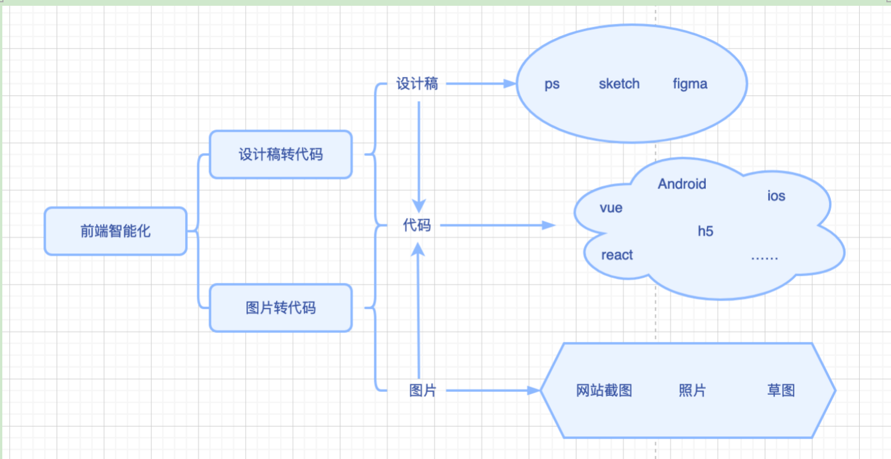

## 行业现状

国内巨头们都已经布局了。大厂如阿里，腾讯，字节，京东、美团。中小厂如58集团、蓝狐、深圳光速。其中行业很优得阿里团队。国外微软最早开源，国内58开源。

| 公司     | 产品名              | 对外发布时间 | 核心能力                                                                                              | 团队规模 | 开源情况 | 用途     |
| -------- | ------------------- | ------------ | ----------------------------------------------------------------------------------------------------- | -------- | -------- | -------- |
| 阿里     | imgcook             | 2019年12月   | 设计稿和截图转代码,支持生成vue/react/android/flutter/小程序等代码,h5活动页发布,vscode插件连接平台能力 | 40+      | 部分开源 | 开发平台 |
| 腾讯     | codesign            | 2021年3月    | h5活动页发布支持生成h5/vue等代码                                                                      | -        | 不开源   | 商业     |
| 京东     | Deco                | 2021年11月   | 支持生成h5/vue/react/taro等代码h5活动页发布                                                           | -        | 不开源   | 自用     |
| 美团     | 积木Sketch Plugin   | 2021年5月    | -                                                                                                     | -        | 不开源   | 自用     |
| 58集团   | Picasso             | 2020年9月    | 支持h5代码生成                                                                                        | -        | 开源     | 免费     |
| 转转     | 神笔马良            | 2021年10月   | 支持h5/vue/ts代码生成                                                                                 | -        | 不开源   | 自用     |
| 微软     | sketch2code         | 2018年1月    | 截图转h5代码                                                                                          | -        | 开源     | 免费     |
| 字节     | arco.design（组件） | 2021年10月   | 支持vue/react代码生成                                                                                 | -        | 开源     | 免费     |
| 蓝狐     | 蓝狐                | 2021年3月    | 支持h5/vue/react/小程序                                                                               | -        | 不开源   | 商业     |
| 深圳光速 | codeFun             | 2021年10月   | 支持h5/vue代码生成                                                                                    | -        | 不开源   | 商业     |

## 多种实现方向

有如下3种：
1、偏向于C端，运营类项目。从sketch插件或截图到DSL转化，再到期望的代码模板，结合低代码能力，可放大实现效果。如京东、阿里、腾讯等的实现。

‌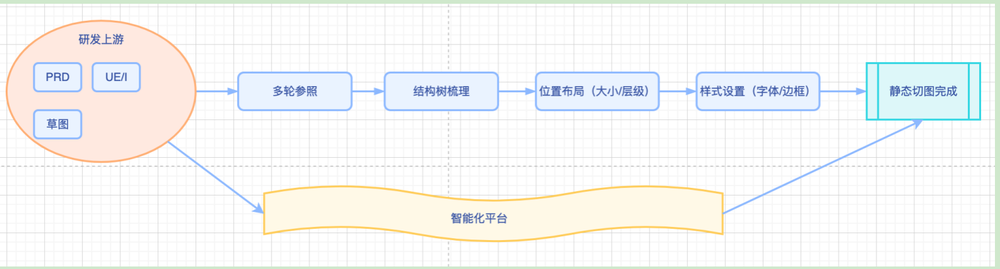

2、兼顾pc及h5项目，从工程代码入手，让代码及组件生成的代码可编辑。业务方向使用sketch或低代码工具一样可编辑及可得。如[`plasmic`](https://github.com/plasmicapp/plasmic)
‌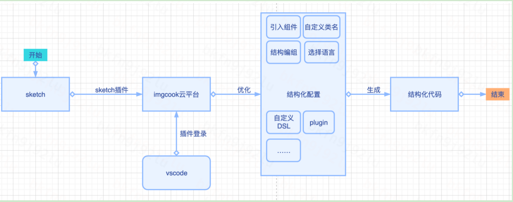

3、偏向平台类项目，根据经验做好项目模板和原子库，用户通过拓展组装成想要的平台。如蚂蚁宜搭，apass项目等。
‌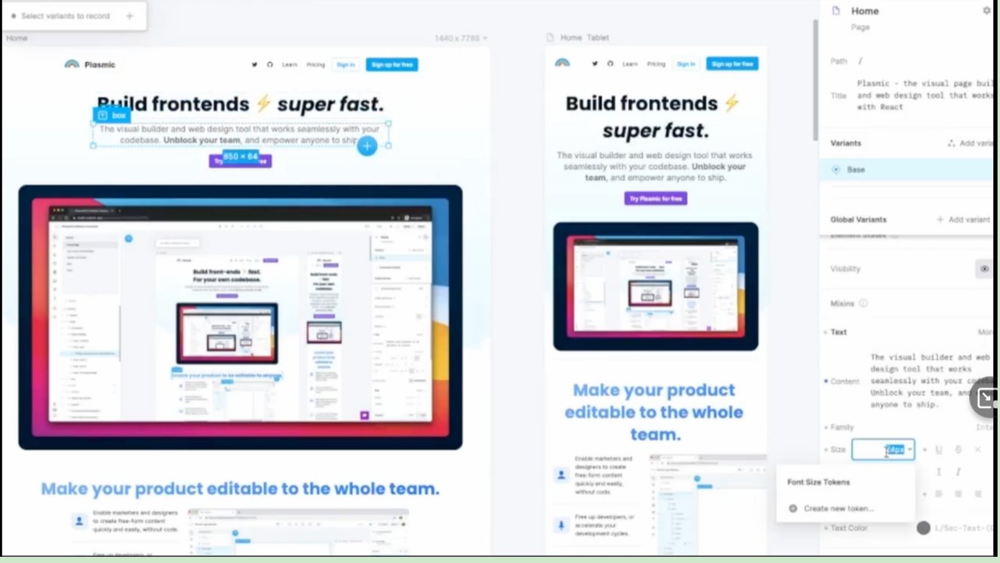
## 可达成路径
基于sketch插件的探索。一共分为三步。
先介绍一下，sketch插件开发架构图, 6个层，从上到下执行流程，最后生成自用的插件。
‌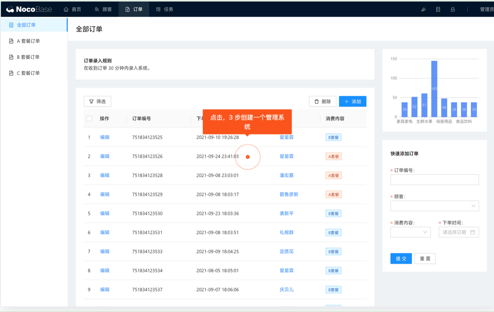
### 一、sketch插件和设计稿JSON
1、sketch本身就是一个软件工具，提供给用户的工具有图层、容器、形状、文本等，这一系列动作产生的设计稿都可以转换为一个json来表示。
‌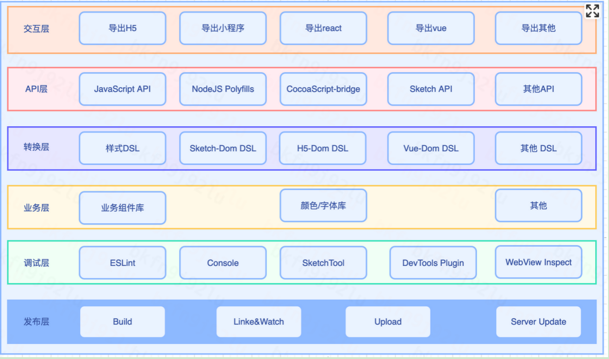
2、规范化设计与开发之间的标准结构。
对设计稿进行图层重构（基于位置，大小，层次等属性，重新排版），变成开发期望的图层描述结构。
‌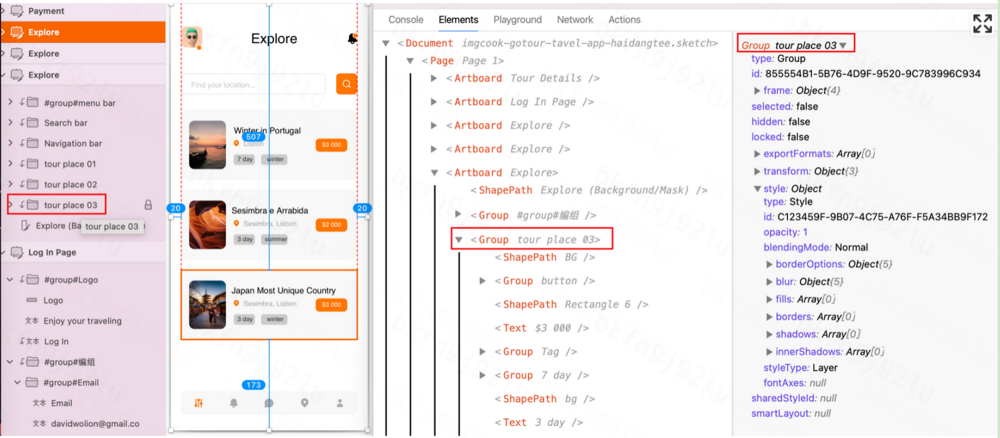
‌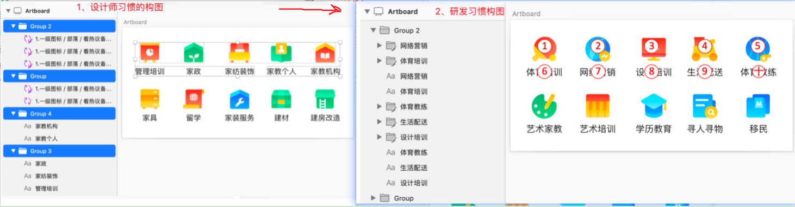
### 二、将设计稿JSON基于DSL转化语言模板
DSL（领域专用语言）把设计稿JSON中的特征字段解析成我们想要的领域语言结构。
设计稿JSON蕴含了如下信息：
1）画板元素结构信息（前后左右元素组织）
2）关联信息（子父，兄弟）
3）外观信息（宽高颜色透明度边框）
4）位置信息（坐标，层级，前后左右）
5）类型信息（文本，图片，形状）
6）衍生信息：相似性
我们领域语言特征（以vue为例）：
1）布局通用特征：节点结构，节点类型（div/image/），节点顺序，节点大小，节点层级，节点外观，节点位置(上下左右)
2）vue特征模板(.vue)：上布局，中脚本，下样式
导入项：全局样式，vue框架文件 逻辑层：模块化结构，data、生命周期、method， 样式层：常用样式、样式顺序，结构
‌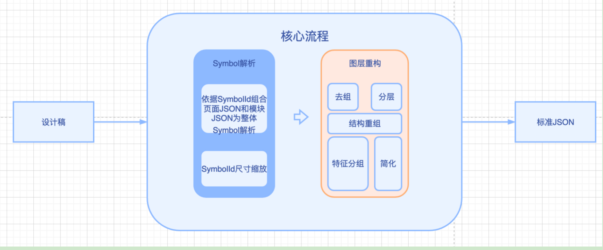
‌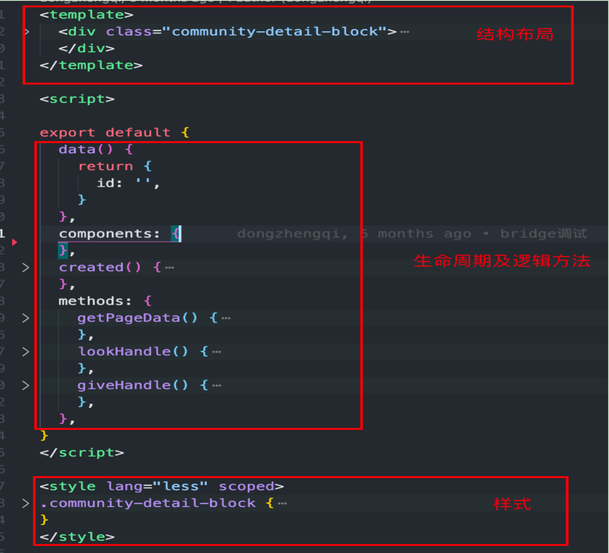
‌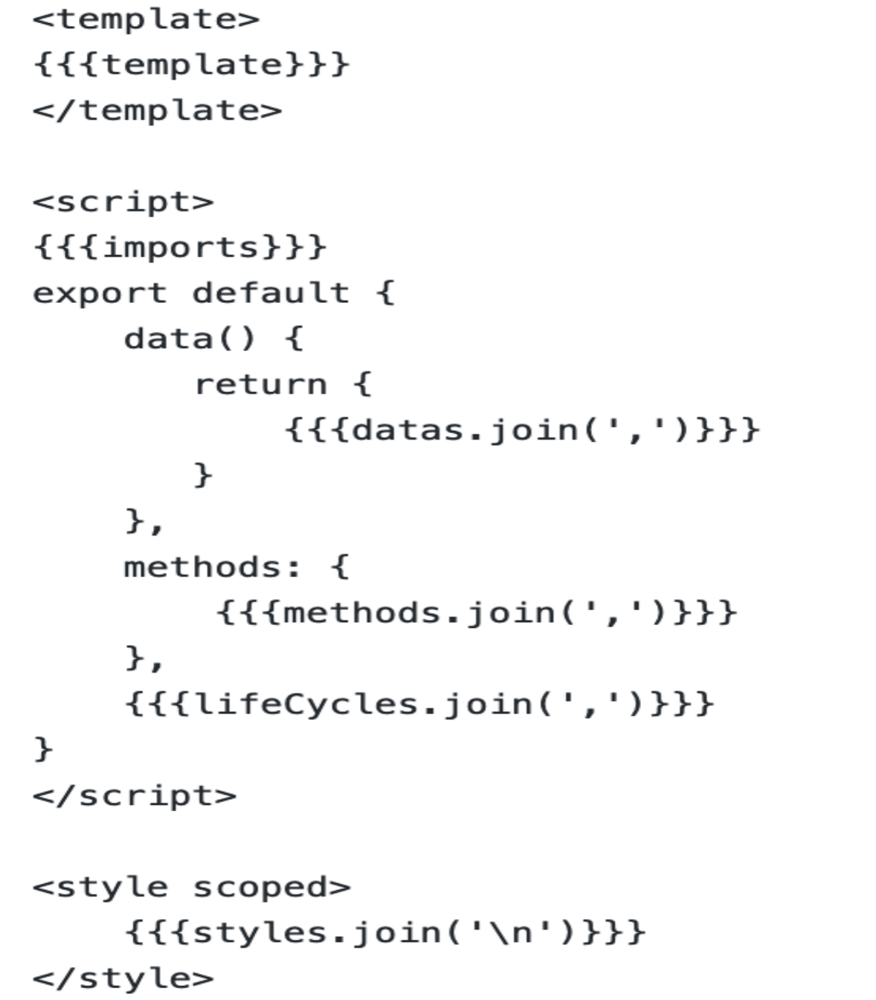
3、扩展第二步能力，搭建智能平台，应对更复杂得场景。
拓展能力：自有组件的DSL库、图片AI识别，多种端领域语言能力(Android/ios),样式规范（下划线/大驼峰）,元素单位(px/pt/rem/rpx)
下图是比较完整的平台架构，包括关键的功能模块。最有技术挑战的是AI平台。
‌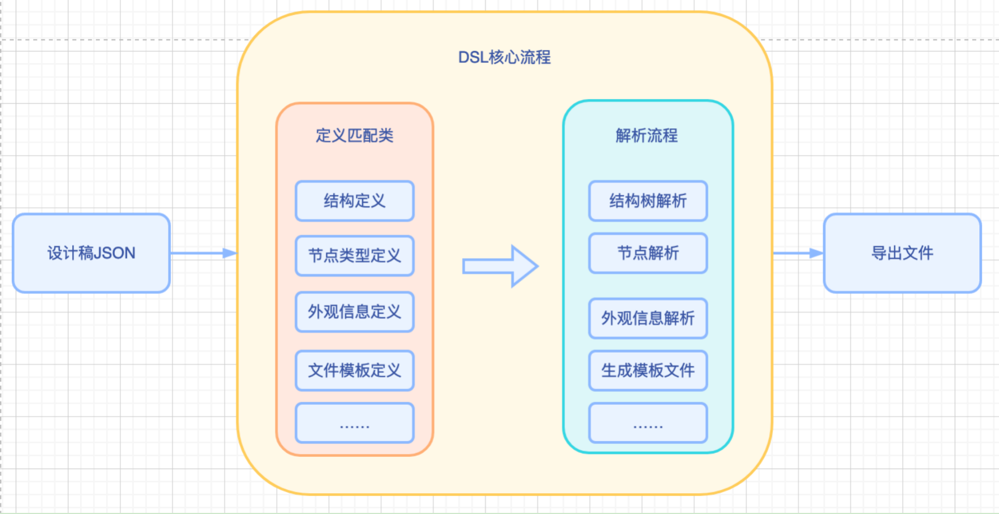
## 总结
技术为业务赋能，D2C为技术赋能！
感谢大家的参与，有不足之前请大家帮忙补充，期待一起共建。
## 参考文献
1、sketch手册：http://www.sketchcn.com/sketch-chinese-user-manual.html#fills
2、imgcook（部分开源）：https://www.imgcook.com/
3、转转马良（不开源）：https://blog.csdn.net/P6P7qsW6ua47A2Sb/article/details/123911152
4、58-毕加索（开源）：https://github.com/wuba/Picasso/
5、微软草图转代码（开源）：https://github.com/Microsoft/ailab/tree/master/Sketch2Code
6、组件转代码（开源）：https://github.com/plasmicapp/plasmic
7、腾讯codesign（不开源）：https://codesign.qq.com/hc/design/codefun/
8、codeFun（不开源）：https://code.fun/
9、京东（不开源）：https://deco-preview.jd.com/
10、字节（开源）：https://arco.design/
11、蓝狐（不开源）：https://support.lanhuapp.com/5612/2a6d/86ab#main_content
12、美团（不开源）:https://zhuanlan.zhihu.com/p/360099631
13、美团（不开源）:https://tech.meituan.com/2020/05/21/waimai-sketch-plugin.html
14、sketch中文插件库：https://oursketch.com/plugin
