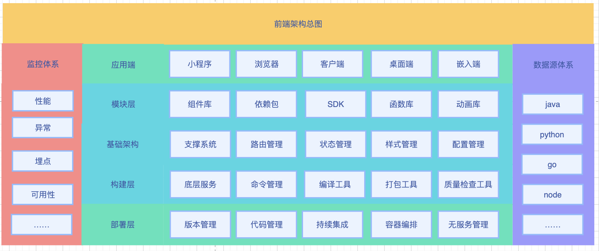

# think-docs

> 工作期间总结和思考的一些整理。
> 前端有这开发快，到处运行的特点，运行环境非常多，如路由器、家电、车机、浏览器，小程序，客户端，桌面端等等用户可是的地方，都有它的存在。业务场景也很多，场景的营销类，运营类，配置类，娱乐类等等。所以兼容性、网络环境、性能、质量监控等都是核心课题。

- 研发流程管理方向
- 跨域方向
- 研发提效方向
- 中台能力建设方向（low-code和apaas）
- 前端智能化（D2C）方向
- 前端工程化方向
- 性能优化方向
- 质量及监控方向
- 微前端方向

