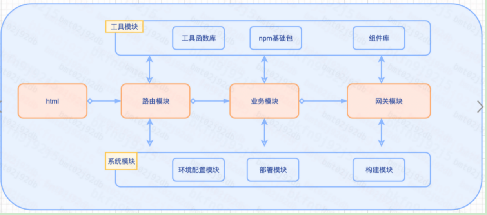

# h5脚手架解析

## 导语
整个工程文件比较多，通过分层分模块，更清晰的认知架构的组成。各个模块各司其职，避免混乱，方便维护，提升开发协作效率。
## 目录结构
- 这个是vue2项目。
Markdown
├─.editorconfig
├─.env
├─.env.development
├─.env.test
├─.env.production
├─.eslintignore
├─.eslintrc.js
├─.gitignore
|-.npmrc
├─babel.config.js
├─bfe.conf
├─build.sh
├─config.sh
├─control.sh
├─deploy_fe_growth_service.sh
├─package.json
├─postcss.config.js
├─readme.md
├─vue.config.js
├─yarn.lock
├─src
|  ├─App.vue
|  ├─main.js
|  |-components
|  ├─views
|  |   ├─demo
|  |   |  └index.vue
|  |   ├─changeEnvPage
|  |   |       └index.vue
|  ├─utils
|  |   ├─index.js
|  |   └regexs.js
|  ├─store
|  |   └index.js
|  ├─router
|  |   ├─index.js
|  |   ├─route.js
|  |   ├─modules
|  |   |    └home.js
|  ├─plugins
|  |    ├─index.js
|  |    ├─vuePlugins
|  |    |     ├─evtbus.js
|  |    |     ├─fastclick.js
|  |    |     ├─globalCompt.js
|  |    |     ├─registerCookie.js
|  |    |     ├─registerOmega.js
|  |    |     └registerStorge.js
|  ├─assets
|  |   ├─style
|  |   |   ├─mixin.less
|  |   |   ├─reset.css
|  |   |   └theme.less
|  |   ├─imgs
|  ├─api
|  |  ├─index.js
|  |  |-envConfig
|  |  |  |-index.js
|  |  |-http
|  |  |  |-index.js
|  |  ├─modules
|  |  |    ├─task.js
|  |  |    ├─config.js
|  |  |    └index.js
├─public
|   └index.html

## 工程架构图
坦克模型：
一辆99式坦克，html模块-炮台。路由模块-方向盘，业务模块-座舱，网关模块-瞭望室。工具模块和系统模块-两侧履带。
医院模型：
一家医院，html模块-门卫，路由模块-分诊台及挂号台，业务模块-治疗台，网关模块-信息同步平台 ，工具模块和系统模块-医院大楼、行政、仪器等平台。
‌‌
‌

## 详解
### 入口模块
对应工程模块：html模块，main.js，app.vue
作用：进入工程内部的入口，相当于医院的大门和宣传拦。用来呈现业务功能及模块的。
配置：
1）html基础结构，用来呈现的dom结构。
2）meta模块，配置响应式布局视窗、
3）业务模块区域，

### 路由模块
对应工程模块：router模块
作用： 控制访问路径的转发，相当于医院的分诊台。
配置：
1）模式配置：history和hash模式配置
2）map表：地址-组件对应。
3）路由守卫（beforeEach和afterEach模块），统一鉴权处理。如token获取和验证
### 业务模块
对应工程模块：src/view ，components模块
作用：业务的具体实现
配置：
1、业务数据
2、业务逻辑及通信
3、业务交互及组件

    
### 网关模块
对应工程模块：api模块
作用：控制业务与外界交互数据等，相当于商务或采购。
配置：
1、所有发出请求的统一处理，如添加token，自定义header
2、所有响应请求的统一处理，如401状态、网络异常等
3、所有接口请求的统一封装。如
4、所有请求方式封装，如get、post、jsonp等
5、黑白名单设置，如特殊请求的特殊流程等

    
### 工具模块
对应工程模块：style、utils、plugin模块
作用：为业务等各模块正常运行提供高效的方案或策略，相当于仪器室。
配置：
1、全局指令、过滤器的封装
2、全局日期、url参数等处理函数
3、全局字符串、数组、对象的处理函数
4、三方插件的封装，如埋点、bridge等
5、其他，如UI组件库、cookie,lodash/storejs/qs等
   
### 系统模块
对应工程模块：package.json、build.sh、vue.config.js、gitingore、babel、env
作用：负责工程环境配置、构建部署发布等，相当于行政单位，提供大楼、环卫、仪器、档案室等。
配置：
1、打包构建能力
2、发布项目能力
3、代码检查、风格规范及提交能力
4、研发环境配置，如dev、test、prod等
5、其他，如npm包及命令配置

## 结语

基于现有认知和实践的总结，如果大家有好的建议，欢迎一起完善。
