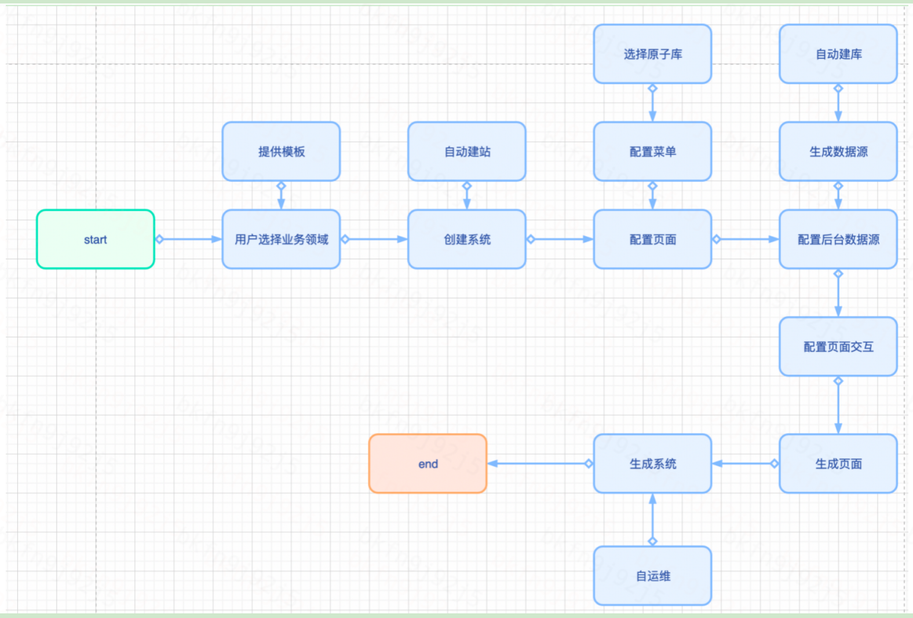
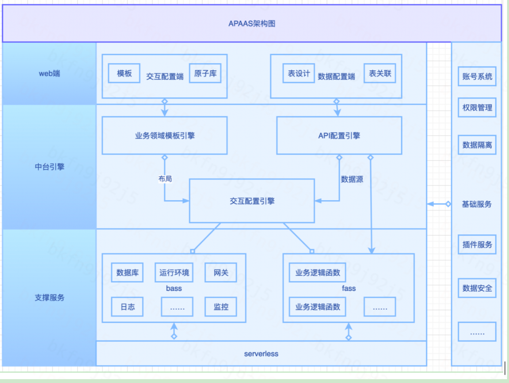
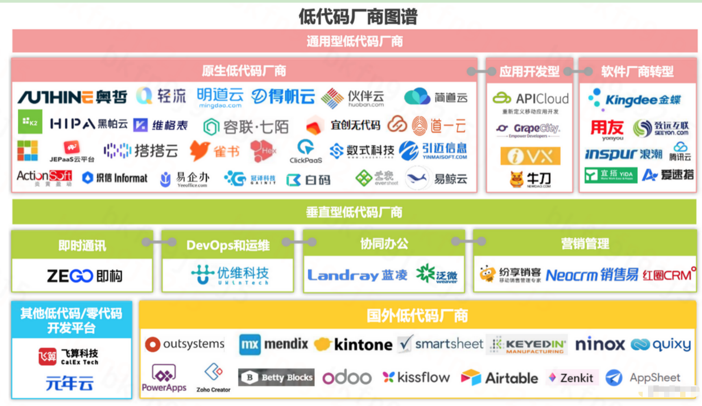

# 中台能力建设

## 什么是中台

技术中台-微服务框架、devops平台、paas平台、容器云等  
共享服务业务中台-客服中心、订单中心  
数据服务中台-数据交换共享、数据分析建模、大数据可视化  
业务中台- apaas平台，即Application Platform as a Service: aPaaS(应用平台即服务)是一类基于云的软件，它为用户提供了一个开发、部署和管理应用程序的平台，而无需构建和维护通常与开发和启动应用程序相关的基础设施的复杂性。它为用户提供开发新应用的硬件、操作系统、存储或网络能力。  

我们更侧重于业务中台，为前台业务提供支撑的共享服务平台，核心目标是为企业实现快速业务响应能力和规模化创新能力提供支撑。  

## 建设原则

1 高内聚，低耦合原则  
系统流程，内聚；系统之间，解耦  
2 数据完整性原则  
业务流程、逻辑、相关性数据呀完整独立。  
3 业务可运营性原则  
业务系统是符合业务逻辑，运营流程、产生业务价值的业务单元；产生的业务数据，可以沉淀，做数据分析。  
4 渐进性原则  
小步快跑，不断迭代完善。  
只有真实需求确定的业务需求才会锤炼出稳定可靠的中台服务。  

## 当前有哪些业务场景

1、商城  
2、xx保  
3、xx诊断  
4、ugc/pgc  
5、客服系统  
6、可视化平台  
7、……  

期望，把这些业务场景，业务平台整合起来，通过配置化高效完成，满足业务使用。  

## 研发需要具备哪些能力

1、平台脚手架  
2、平台UI组件库、函数库  
3、业务原子库  
4、模板化得系统（如橙页）  
5、可配置表单（如幻视）  
6、自动配置平台-apaas平台  

有了代码库、低代码工具积累之后，我们的终极目标是 apaas平台，无代码的云配置平台。  

## apaas平台

是一个云平台，通过模板系统和原子库，页面可视化拖拽，快速生成业务领域系统，实现全流程配置化，数据隔离，独立运行得系统。  
用户价值  
配置简单，快速满足需求并投入应用；提升业务效率。  
配置流程图：  
 ‌

## 可行性方案

1、建站，一套从开发到发布的项目流程  
2、建系统模板，扩展业务领域模板（路由及页面）  
3、建原子库，扩展业务领域原子库（页面元素及组件）  
4、建数据源，支持自定义数据集（展示的数据及接口）  
5、支持扩展，支持导入系统模板和原子库（插件）  
6、鲁棒性设计，在各种情况下正常运行（监控及日志）  
7、用户手册  
架构图：  
 ‌

## 核心能力

1、模板库--业务系统级  
2、原子库--页面元素级  
3、库表设计--接口级  
4、运维能力--系统级  
5、业务场景--业务流程级  

## 需要的支撑

1、数据库服务  
2、云空间服务  
3、前端运维服务  
目前serverless可以提供这些支撑，serverless是新概念，逐渐趋于成熟。滴滴内部ddfs团队在建设，处在初期。  

## 技术关键点

1、原子交互设计（数据交互、行为交互）  
2、数据存储及销毁（没有无限空间）  
3、自运维（独立容器、易销毁，自动伸缩，易复制）  

## 平台建设难点

1、需要对业务场景有深入理解  

## 技术选型

1、前端-vue/react  
2、服务端-nodejs
3、运维-serverless  
4、数据库-  
5、其他-

## 人力评估

1、前端、服务端、运维端，各至少一人。  

## 时间评估

1、技术上很多细节没有打通，前期积累时间比较长  
2、业务领域方向，缺少细致得认知；需要投入时间调研。  

## 现状

1、对全流程设计，有部分经验。  
2、单点技术上无卡点，整体串联无经验。  
 从整体看，风险不大。利用行业现有开源系统，打一套系统是比较快捷的。如明道云、nocobase，formliy等，钉钉易搭很流行，不开源。  

## 下一步

1、先选一个业务场景  
2、使用开源平台，打造一个mini版本的apass，如明道云私部版  
3、时间先粗估一个季度  

## 附录

‌  

## 参考文献

1、nocobase：<https://cn.nocobase.com/#how-it-works>  
2、amis：<https://aisuda.bce.baidu.com/amis/zh-CN/docs/index>  
3、明道云：<https://github.com/mingdaocom/pd-openweb>  
4、钉钉易搭: <https://www.aliwork.com/home>  
5、formily：<https://github.com/alibaba/designable>
6、中台概念：<http://www.360doc.com/content/19/0619/15/64836812_843519211.shtml>  
