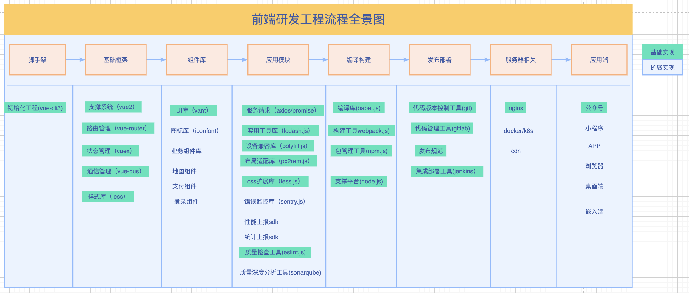
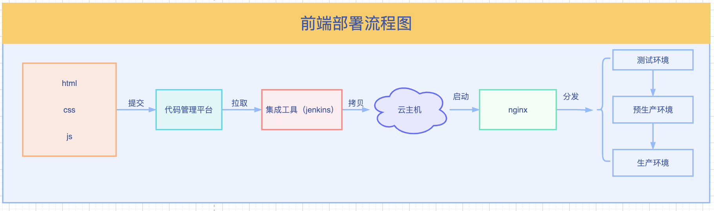

# 前端工程化方向

>前端从最初只用`function`到现阶段使用脚手架、编译、构建、CI/CD等方式开发演化，承担的业务能力越来越多，开发效率也越来越高，离不开前端开发的工程工具的诞生。

## 工程架构图

> 图上列举了一些代表性的环节，现阶段前端的工程工具可以说是琳琅满目，并且还在高速制造中...。基本上月月有新货。
> 工程环节基本上就是这么多，可以发力的地方也就这些。
> 现阶段主要需要发力的是D2C环节，引进人工智能的能力。

## 前端部署

相比较客户端和服务端，前端部署很有特点。
> 小程序直接在平台上发布
> h5和pc项目，需要申请备案域名，项目部署到cdn或云主机上。
> nodejs项目类似于服务端部署。

