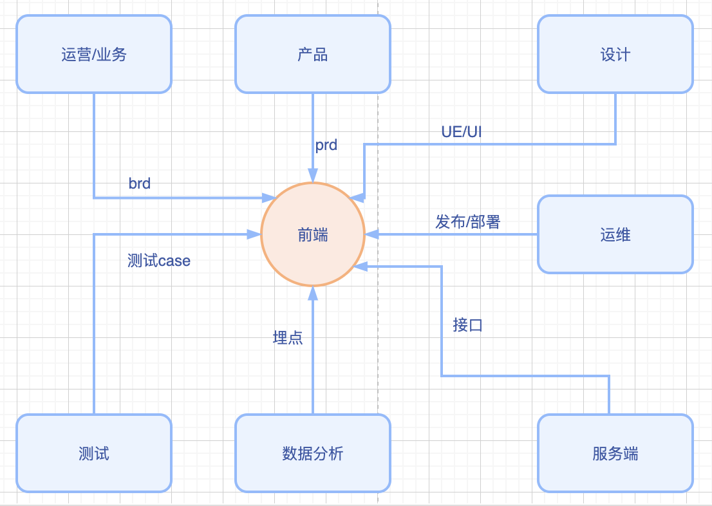
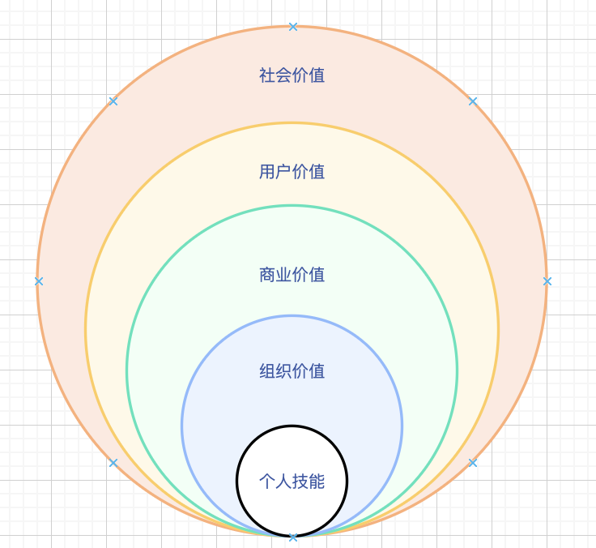

# 工程师发展能力思考

在一个研发周期内，前端工程师会与项目有关的所有角色发生交集。对各个角色的专业方向都有了解，才能有效沟通，合作共赢。

## 11项能力

> 1、项目管理，评审，排期预估，调研落地，拉通对齐各角色认知。
> 2、前端研发，vue应用框架、游戏类，微信系、跨端类、pc可视化、工程化、组件库等
> 3、运维研发，编译，部署，jenkins，gitlab，linux、网络、dns，cdn，k8s，docker等
> 4、质量研发，单测，bug率，case编写、静态代码扫描，代码质量预判等
> 5、业务思维，业务核心流程，业务运作，法务法规政策、预算等
> 6、服务端研发，java，缓存、数据库、qps，mq，python，go，nodejs等
> 7、团队管理，薪资期望、工作期望，团队氛围等
> 8、核心课题研究（性能、项目资源调配、质量把控，错误监控，应急响应，团队战斗力提升，研发提效，前端智能化，工程化，数据体系建设及分析，机器学习及贝叶斯网络等,稳定性和可用性）
> 9、算法及模式，常规算法、业务算法、设计模式（双向绑定，mvvm,mvp）等
> 10、用户思维，用户习惯、用户爱好、用户信息（设备、 网络、时段、 用户经济情况）等
> 11、数据思维（大数据聚合、埋点，实时数据clickHouse等，核心计算指标、业务指标，数据可视化）等

公司都需要T或π型人才，从深度和广度的发展角度，需要立足前端研发能力，向其他各个专业方向延生。

## 发展阶段建议

> 工作的1-5年，以修技为主，各类业务场景的项目都可以按期高质完成，积累常见错误的解决方案；常见场景的技术方案。
> 工作的5-10年，以业务和商业思维为主，各类业务的流程环节是什么？商业模式是什么？技术如何赋能，才能使业务流程更顺更快，商业模式更有核心竞争力更有盈利价值。
> 工作的10年以上，以用户价值为主，站在云端往下看，整个商业系统如何运作？整个大环境如何运作？通过技术手段，如何最大化商业价值，用户价值。更有社会价值和责任感。

