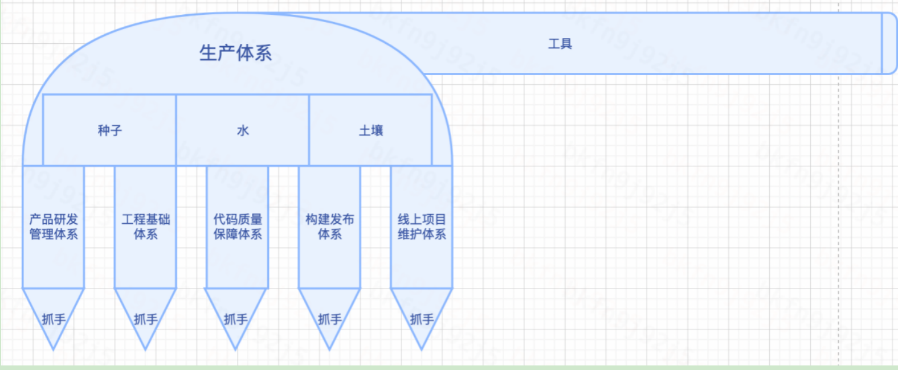

# 前端研发团队能力建设思考

## 研发团队基础建设的思考

业务前端团队发展阶段搭建思考

业务团队的初级装备，李云龙清楚团队有多少人，多少武器、能打什么仗
工作一段时间，一直在思考一个问题，前端团队具备什么条件，就可以出征了！就像一个战斗小组，配置什么样的装备，具备什么素质，就能单独作战了。经常看《亮剑》，李云龙的独立团，具备什么样的武装，就可以考虑打平安县城呢？

### 目录

1）工程基础体系：脚手架，如 h5、pc、小程序等，vue-cli，react-cli，mpx、bridge  
2）代码质量保障体系：代码规范（eslint、lint、Prettier ）、sonar、cr  
3）构建发布体系：构建流水线（编译打包流程）+发布流程（上传cdn，云容器）+接入层配置(配置域名解析及项目服务启动)  
4）线上项目维护体系：SourceMap代码异常收集、报警策略捕获指标异常、值班机制响应处理问题。  
5）产品研发管理体系：总设及评审+排期规划+mock平台  

- 研发作为一个生产团队，从0-1组建，需要具备一些基础的技能和资源，然后才能投入生产。  
‌

#### 工程基础体系（坦克模型）

脚手架  
h5，vue生态+vant+webpack/vite  
pc，react生态+antd+umi  
小程序，mpx/wepy/uni-app  
函数库，lodash，cookies，storejs，qs  
网络库,axios，promise  
插件，性能统计、埋点统计、  

#### 代码质量保障体系

代码规范：vue，ract、js/ts/css/html等规范  
CR流程：meeting+mr  

#### 构建发布体系

编译发布流水线  
云部署+cdn  
接入层配置  

#### 线上项目维护体系

服务监控（sourcemap异常监控、埋点上报、云容器cpu/内存/网络监控，域名可用性监控，cdn监控）  
报警策略（核心指标预警）  
值班机制（核心问题响应机制）  
灾备应急（多活、自动扩缩容，限流）  
定期巡检（组织团队检修演练，整理业务模块，入口，绘制业务架构图，测试核心case，兼容性测试等）  

#### 产品研发管理体系

研发流程  
工具链  
sop  

## 研发团队战斗力的思考

对于团队人效不足、性能不好、质量欠佳，基础系统少，新人多等痛点，有如下解法。  

从团队、项目、工程角度出发：  
1.人效体系的建设  
2.质量体系的建设（线上和线下）  
3.效能平台的建设  
4.数据可视化建设  
5.人员招聘及培养建设  
6.个人影响力建设  
以上动作的目标：建设高效的组织，打造稳定的系统。  

### 规划详细解读

#### 1.人效体系的建设

痛点：现阶段组织松散，分工不合理，新人居多，业务不熟。  
解法：  
1）业务方向，3人一组，设置owner；老带新，负责固定业务板块。长期积累和沉淀，会更加熟练和提效。  
2）技术方向，成立组件库小组、性能小组、质量小组、效能小组；推进基建落地及提效。  

#### 2.质量体系的建设（线上和线下）

痛点：现阶段线上bug和线下bug较多，交付质量差  
解法：  
1）成立质量小组，定期复盘，问题归类及统计，不断PDCA/SDCA，建立规范。  
2）建立质量监控系统，自动采集平台异常、代码异常等异常信息，并上报平台进行跟踪  

#### 3.效能方向的建设

痛点：缺少组件沉淀、类似功能重复开发，效率低下，代码臃肿，流程冗长，难于维护  
解法：  
1）成立组件库小组，复杂组件抽取及开发，提升开发效率  
2）围绕ROI，梳理业务流程图，找到冗长和卡点，优化链路，提升转化效率。  

#### 4.数据可视化建设  

痛点：目前业务数据、性能数据、异常数据等未有效呈现，影响决策和进一步动作  
解法：  
1）成立可视化小组，负责数据收集，定制化呈现  
2）与数据团队协同，建设供高效决策的数据系统  

#### 5.人员招聘及培养建设

痛点：团队成员梯度不足，整体业务能力、技术能力偏弱；导致人效、质量及基建不足  
解法：  
1）开通内推、活水通道，寻找行业能力强的人才  
2）建立培养体系，定期业务流程图绘制及讲解，共同学习相关经典书籍，如《数据结构和算法》、《设计模式》。还有vue及生态工具源码解读、项目典型技术案例分享、流程及工程管理分享等，提升业务理解及技术能力  

#### 6.个人影响力建设

痛点：相互陌生，彼此能力不了解，做事风格不了解。  
解法：  
1）解决团队中的痛点，助力团队成长。  
2）合作共建系统，助力各干系人高效工作，业务高效运作。  
重点动作  
1.梯度搭建，组成先锋组；快速消化业务需求，提升业务运作效率  
1）寻找有潜力同学，组成先锋组；如晓丽、涂珊、李健、印盘、亚生等，加快组织正规化。  
2）业务分组，快速推进项目，提升人效，加快数据平台建设  
2.系统建设，完善流程，提升运作研发效率
1）组件库（bp端、c端），提升开发效率  
2）参考其他业务线，配置基础系统，如性能数据、异常数据、日志、运营、发布系统等，到达五脏俱全，流程及工具完善。  

## 结语

能力有限，有不足之处请多多指教!  
