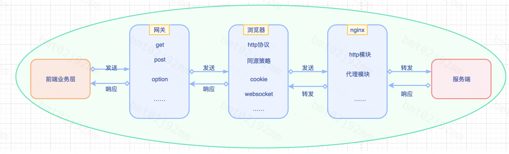
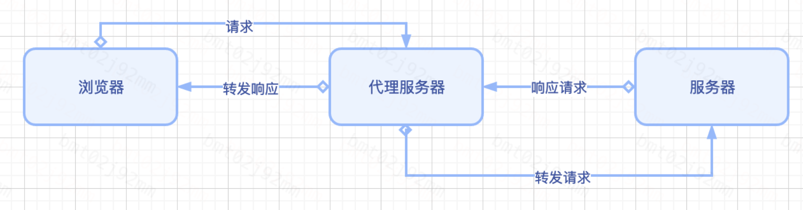
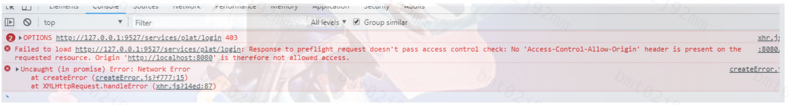
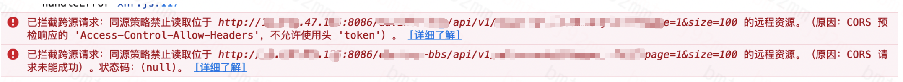
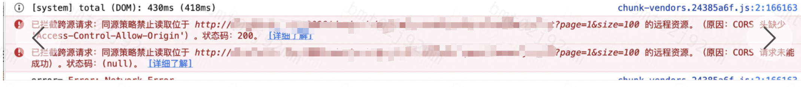
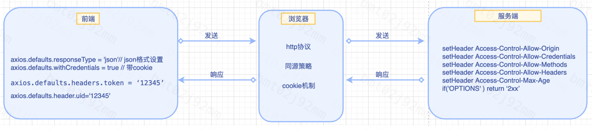
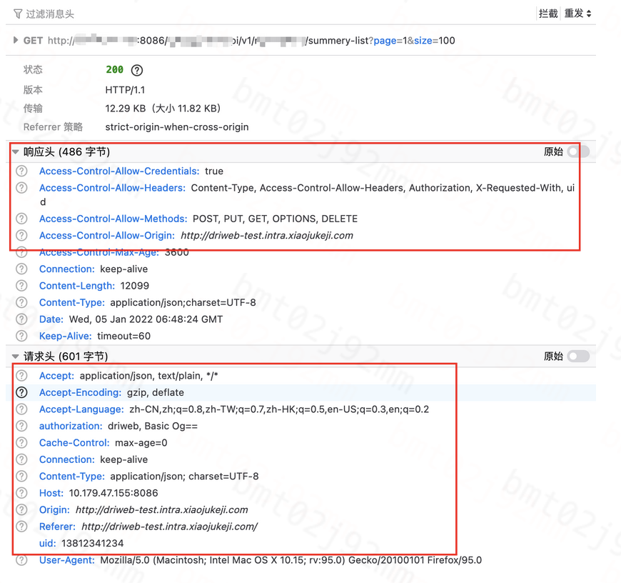

# 前端跨域方案

## 导语
前端项目绝大多数运行在浏览器上，浏览器是一个开放的平台，为了保障各类域名网站的数据安全，浏览器设置了一个安全功能，就是同源策略。从而产生了我们经常绕不开的话题：跨域问题-不同源问题。前后端交互的时间，90%的情况下会遇到跨域，每次都非常耗时间。所以这是架在前后端的一道坎，下面我们来一个全面解读，彻底搞清楚弄明白，跨过这道坎。

## 需要关注的岗位
 – 前端、服务端、QA
 – 跨域问题，需要前端提出，服务端协助解决，QA自研系统也会遇到类似情况。

## 背景
目前技术架构，多采用的是前后端分离的架构，具有前后端独立开发、独立部署的特点，并行开发，加快项目生产的速度。一般有2种技术方案：
1）前后端同域名，配置路由转发策略时需要避开冲突；需要统一一份nginx配置。理论上不存在跨域问题。
2）前后端不同域名，需要配置一层转发，解决跨域问题。
2种方案各有利弊，目前我们采用不同域名部署。
‌
## 为什么前后端域名不同？
优点：
1）前后端独立nginx，没有共同配置，新增或重启，互不影响。
2）路由没有冲突。
3）日志独立，容易排查。
缺点：
1) 存在跨域问题。 
2) 多一个域名的费用
基于服务独立性的考虑，采用不同域名的方案。

## 为什么会出现跨域？
4.1 同源策略
出于浏览器的同源策略限制。同源策略（Sameoriginpolicy）是一种约定，它是浏览器最核心也最基本的安全功能。
同源（即指在同一个域）就是两个页面具有相同的协议（protocol），主机（host）和端口号（port） ，即： 同源 = 协议（protocol）+ 主机（host）+ 端口号（port）
例：
http://localhost:8088/task   . 协议：http  ，主机：localhost，端口号：8088 
https://www.baidu.com/      . 协议：https  ，主机: www.baidu.com，端口号：80

4.2 无同源的危害
如果缺少了同源策略，则浏览器的正常功能可能都会受到影响。可以说Web是构建在同源策略基础之上的，浏览器只是针对同源策略的一种实现。
4.3 同源作用
同源策略会阻止一个域的javascript脚本和另外一个域的内容进行交互。
4.5 具体特点
（1） 无法用js读取非同源的Cookie、LocalStorage 和 IndexDB 无法读取。这些都是存储用户信息的API，安全性要求较高！
（2） 无法用js获取非同源的DOM 。
（3） 无法用js发送非同源的AJAX请求 。更准确的说，js可以向非同源的服务器发请求，但是服务器返回的数据会被浏览器拦截。
注意：同源策略是由浏览器来执行。所有的限制都是浏览器的作用。这是浏览器为了保护用户的数据安全而采取的策略。如果你用的浏览器没有执行同源策略，你登录网站的所以信息都会被窃取。

## 应用场景及CASE
从业务角度，常见的应用场景如下：
-- 前端向不同域名下的服务端发送get请求获取数据，发送POST请求获取数据
-- 为了保留用户登录凭证，需要自定义header，或带上cookie
-- 所有请求设置成通用json类型。
-- 组合网站相互交互数据
-- 其他
基于以上场景，设置相关的跨域配置。

## 流程图
图示是一艘船，从左向右走到头，需要经历3道门，才能访问到「服务端」。
‌

## 解决跨域的方案
同源策略就如同进入地铁站的安检一样，是一层监管（网关），只是为了确认安全，并不是为了完全隔绝不同域的通信。我们确实需要跨域获取cookie等信息，需要建立一个信任的通道，怎么办呢？有如下几种跨域方案：
7.1 主域相同，子域不同的应用场景
设置`document.domain`解决无法读取非同源网页的 Cookie问题，适用于主域相同，子域不同的跨域应用场景
     因为浏览器是通过`document.domain`属性来检查两个页面是否同源，因此只要通过设置相同的document.domain，两个页面就可以共享Cookie。如a.test.com 和b.test.com 。
    两个页面都需要设置：`document.domain = 'test.com';`
7.2 多窗口通信的应用场景
跨文档通信 API：`window.postMessage()`
     调用postMessage方法实现父窗口`http://test1.com` 向子窗口 `http://test2.com`发消息（子窗口同样可以通过该方法发送消息给父窗口）
     应用场景：
      1）页面和其打开的新窗口的数据传递(同级)
      2）多窗口之间消息传递(同级)
      3）页面与嵌套的iframe消息传递(父子级)
```js


// 父窗口打开一个子窗口
   var openWindow = window.open('http://test2.com', '你好2022');
// 父窗口向子窗口发消息(第一个参数代表发送的内容，第二个参数代表接收消息窗口的url)// 发送信息
   openWindow.postMessage('Nice to meet you!', 'http://test2.com');
// 监听 message 消息
   window.addEventListener('message', function (e) {
     console.log(e.source); // e.source 发送消息的窗口
     console.log(e.origin); // e.origin 消息发向的网址
     console.log(e.data);   // e.data   发送的消息
   },false);
// 参考文献：https://developer.mozilla.org/zh-CN/docs/Web/API/Window/postMessage
 ```
7.3 JSONP
JSONP 是服务器与客户端跨源通信的常用方法。最大特点就是简单适用，兼容性好（兼容低版本IE），缺点是只支持get请求，不支持post请求。

核心思想：网页通过添加一个`<script>`元素，向服务器请求 JSON 数据，服务器收到请求后，将数据放在一个指定名字的回调函数的参数位置传回来。
```js
<script src="http://test.com/java.do?callback=demoFunction"></script>
// 向服务器test.com发出请求，该请求的查询字符串有一个callback参数，用来指定回调函数的名字
 
// 处理服务器返回回调函数的数据
<script type="text/javascript">
    function demoFunction(res){
        // 处理获得的数据
        console.log(res.data)
    }
</script>
```
7.4 CORS-重点
CORS 是跨域资源分享（Cross-Origin Resource Sharing）的缩写。它是 W3C 标准，属于跨源 AJAX 请求的根本解决方法。
7.4.1 普通跨域请求
只需服务器端设置 `Access-Control-Allow-Origin:*`
7.4.2 带cookie跨域请求
【前端设置】根据 `xhr.withCredentials`字段判断是否带有cookie ，如我们使用axios做网络库时，代码示例：`axios.defaults.withCredentials = true`  
【服务端设置】
```js
Access-Control-Allow-Origin:reqs.getHeader("Origin") 
Access-Control-Allow-Credentials : true
```
7.4.3 非简单请求
  发送get/post请求时，会先发一个OPTION请求，预检查。常见于自定义header。如：`axios.defaults.responseType = 'json'`
// 服务端设置
```js
Access-Control-Allow-Origin: http://test.com
Access-Control-Allow-Methods: POST, GET, OPTIONS
Access-Control-Allow-Headers: X-PINGOTHER, Content-Type
// 设置max age，浏览器端会进行缓存。没有过期之前真对同一个请求只会发送一次预检请求
Access-Control-Max-Age: 86400
```
7.4.5 各类服务端通用设置
服务器端对于CORS的支持，主要是通过设置`Access-Control-Allow-Origin`来进行的。当浏览器检测服务端响应头有相应的设置，就可以允许Ajax进行跨域的访问。

a. java后台
```java
/* 
   导入包：
   import javax.servlet.*;
   import javax.servlet.http.HttpServletRequest;
   import javax.servlet.http.HttpServletResponse;
  接口参数中定义：HttpServletResponse response
*/
 
// 允许跨域访问的域名：若有端口需写全（协议+域名+端口），若没有端口末尾不用加'/'
response.setHeader("Access-Control-Allow-Origin", "http://www.domain1.com"); 
 
// 允许前端带认证cookie：启用此项后，上面的域名不能为'*'，必须指定具体的域名，否则浏览器会提示
response.setHeader("Access-Control-Allow-Credentials", "true"); 
 
// 提示OPTIONS预检时，后端需要设置的两个常用自定义头
response.setHeader("Access-Control-Allow-Headers", "Content-Type,X-Requested-With,");
```
b. nodejs后台
```js
var http = require('http');
var server = http.createServer();
var qs = require('querystring');
 
server.on('request', function(req, res) {
    var postData = '';
 
    // 数据块接收中
    req.addListener('data', function(chunk) {
        postData += chunk;
    });
 
    // 数据接收完毕
    req.addListener('end', function() {
        postData = qs.parse(postData);
 
        // 跨域后台设置
        res.writeHead(200, {
            'Access-Control-Allow-Credentials': 'true',     // 后端允许发送Cookie
            'Access-Control-Allow-Origin': 'http://www.test1.com',    // 允许访问的域（协议+域名+端口）
            /* 
             * 此处设置的cookie还是test2的而非test1，因为后端也不能跨域写cookie(nginx反向代理可以实现)，
             * 但只要test2中写入一次cookie认证，后面的跨域接口都能从test2中获取cookie，从而实现所有的接口都能跨域访问
             */
            'Set-Cookie': 'l=a123456;Path=/;Domain=www.test2.com;HttpOnly'  // HttpOnly的作用是让js无法读取cookie
        });
 
        res.write(JSON.stringify(postData));
        res.end();
    });
});
 
server.listen('8080');
console.log('Server is running at port 8080...');
```
c. PHP后台
```php
<?php
    header('Content-Type: text/html;charset=utf-8');
    header('Access-Control-Allow-Origin:*'); // *代表允许任何网址请求
    header('Access-Control-Allow-Methods:POST,GET,OPTIONS,DELETE'); // 允许请求的类型
    header('Access-Control-Allow-Credentials: true'); // 设置是否允许发送 cookies
    header('Access-Control-Allow-Headers: Content-Type,Content-Length,Accept-Encoding,X-Requested-with, Origin'); // 设置允许自定义请求头的字段

if($_GET['name']) { 
　　$name = $_GET['name'];
　　echo $name;
} else { 
　　echo "success";
} ?>
```
d. Apache配置
需要使用mod_headers模块来激活HTTP头的设置，它默认是激活的。你只需要在Apache配置文件的`<Directory>`, `<Location>`,` <Files>`或`<VirtualHost>`的配置里加入以下内容即可
```xml
<VirtualHost *:80>
    DocumentRoot /data/www/test
    ServerName test.com
Header set Access-Control-Allow-Origin *
Header set Access-Control-Allow-Credentials true
Header set Access-Control-Allow-Headers "Origin, X-Requested-With, Content-Type, Accept"
    <Directory />
        Options FollowSymLinks ExecCGI Indexes
        AllowOverride All
        Order allow,deny
        Allow from all
    </Directory>
</VirtualHost>
```
7.5 webpack本地代理
在`webpack.config.js`中利用 `WebpackDevServer `配置本地代理，或`vue.config.js`配置webpack代理
‌

// 修改启动端口-设置接口代理
```js
  devServer: {
    port: 8088,
    // sockPath,
    // public: publicHost,
    proxy: {
      '/davinci-api': {
        target: 'http://xx-yy.test.com', // 后台接口域名
        // ws: true, //如果要代理 websockets，配置这个参数
        secure: false, // 如果是https接口，需要配置这个参数
        changeOrigin: true, //是否跨域
        pathRewrite: {},
      },
      '/davinci-bbs': {
        target: 'http://127.1.1.1:8086', // 后台接口域名
        // ws: true, //如果要代理 websockets，配置这个参数
        secure: false, // 如果是https接口，需要配置这个参数
        changeOrigin: true, //是否跨域
        pathRewrite: {},
      }
    }
  },
```
7.6 Websocket(不在同源限制范围内)
Websocket 是 HTML5 的一个持久化的协议，它实现了浏览器与服务器的全双工通信，同时也是跨域的一种解决方案。WebSocket 和 HTTP 都是应用层协议，都基于 TCP 协议。但是 WebSocket 是一种双向通信协议，在建立连接之后，WebSocket 的 服务器与 客户端都能主动向对方发送或接收数据。同时，WebSocket 在建立连接时需要借助 HTTP 协议，连接建立好了之后 client 与 server 之间的双向通信就与 HTTP 无关了。
```js
// 初始化一个 WebSocket 对象
var ws = new WebSocket("ws://localhost:8088/echo");

// 建立 web socket 连接成功触发事件
ws.onopen = function () {
  // 使用 send() 方法发送数据
  ws.send("发送数据");
  alert("数据发送中...");
};

// 接收服务端数据时触发事件
ws.onmessage = function (evt) {
  var received_msg = evt.data;
  alert("数据已接收...");
};

// 断开 web socket 连接成功触发事件
ws.onclose = function () {
  alert("连接已关闭...");
};
```
7.7 Nginx反向代理
实现原理类似于 Node 中间件代理，需要你搭建一个中转 nginx 服务器，用于转发请求。

使用 nginx 反向代理实现跨域，是最简单的跨域方式。只需要修改 nginx 的配置即可解决跨域问题，支持所有浏览器，支持 session，不需要修改任何代码，并且不会影响服务器性能。

我们只需要配置nginx，在一个服务器上配置多个前缀来转发http/https请求到多个真实的服务器即可。这样，这个服务器上所有url都是相同的域 名、协议和端口。因此，对于浏览器来说，这些url都是同源的，没有跨域限制。而实际上，这些url实际上由物理服务器提供服务。这些服务器内的 javascript可以跨域调用所有这些服务器上的url。

先下载nginx，然后将 nginx 目录下的 nginx.conf 修改如下：
```sh
# upstream api_servers {
#   server http://10.179.61.238:8080/;
#   server http://10.179.46.231:8080/;
# }


server {
  listen 8080;
  server_name fe.test.com;
  
  location /davinci-api {
 	 add_header 'Access-Control-Allow-Origin' $http_origin;// 跨域设置
     add_header 'Access-Control-Allow-Credentials' 'true';// 带cookie
     add_header 'Access-Control-Allow-Methods' 'GET, POST, OPTIONS';//支持复杂请求，带OPTIONS
     add_header 'Access-Control-Allow-Headers' 'Authorization,Accept,Origin,Keep-Alive,User-Agent,X-Mx-ReqToken,X-Data-Type,X-Auth-Token,X-Requested-With,If-Modified-Since,Cache-Control,Content-Type,Range,uid'; //自定义header
    add_header 'Access-Control-Expose-Headers' 'Content-Length,Content-Range'; 
  	if ($request_method = 'OPTIONS') { //单独处理，返回2xx
     	add_header 'Access-Control-Allow-Origin' $http_origin;
        add_header 'Access-Control-Allow-Credentials' 'true';
        add_header 'Access-Control-Max-Age' 1728000;
        add_header 'Content-Type' 'text/plain; charset=utf-8';
        add_header 'Content-Length' 0;
        return 204;
    }
    proxy_pass http://server.com; #后端域名
    proxy_set_header X-Real-IP $remote_addr;
    proxy_set_header X-Forwarded-For $proxy_add_x_forwarded_for;

  }
  location / {// 前端配置
    index  index.html index.htm;
    root   /home/xiaoju/driweb/dist;
    proxy_connect_timeout 3s;
    proxy_read_timeout 5s;
    proxy_send_timeout 3s;
    try_files $uri $uri/ /index.html;
    # proxy_pass http://localhost:8080;
  }
}
```
最常用的是cors方案。
重点提醒
1、如果需要带cookie，`Access-Control-Allow-Origin` 不能设置为*，必须设置为对应的域名，否则浏览器会拒绝。
2、如果要自定义header，`Access-Control-Allow-Headers`需要添加这个字段。如auth、token、uid等，否则浏览器会拒绝。
3、非简单请求，会在发送get/post请求发送option预请求，需要在`Access-Control-Allow-Methods`添加option处理
## 标准配置
FE,基于axios的前端写法：
```js
axios.defaults.responseType = 'json'
axios.defaults.withCredentials = true
 axios.interceptors.request.use(
      (config) => {
        console.log('request请求：', config, api)
        config.headers.common.authorization = 'driweb'// 设置服务来源某个项目
        config.headers.uid = cookies.get('uid') || '' //需要服务端设置
        return config
      }, (error) => {
        // 请求异常
        console.log('error', error)
        // 抛给业务层处理
        return Promise.reject(error)
      },
    )
```
JAVA
```java
package com.xx;

import org.springframework.core.xx;
import org.springframework.core.annotation.xx;
import org.springframework.xx.xx;

import javax.servlet.*;
import javax.servlet.http.HttpServletRequest;
import javax.servlet.http.HttpServletResponse;
import java.io.IOException;

@Component
@Order(Ordered.HIGHEST_PRECEDENCE)//控制过滤器的级别最高
public class CosFilter implements Filter {
    @Override
    public void doFilter(ServletRequest req, ServletResponse res, FilterChain filterChain) throws IOException, ServletException {
        HttpServletResponse response = (HttpServletResponse) res;
        HttpServletRequest reqs = (HttpServletRequest) req;
        response.setHeader("Access-Control-Allow-Origin", reqs.getHeader("Origin"));//动态匹配请求域名来源
        response.setHeader("Access-Control-Allow-Credentials", "true");//带cookie
        response.setHeader("Access-Control-Allow-Methods", "POST, PUT, GET, OPTIONS, DELETE");//支持多种请求类型
        response.setHeader("Access-Control-Allow-Headers", "Content-Type, Authorization, X-Requested-With, uid");//添加自定义header，如uid
        response.setHeader("Access-Control-Max-Age", "3600");//缓存设置
        if ("OPTIONS".equalsIgnoreCase(((HttpServletRequest) req).getMethod())) {//对于非简单请求，option预检请求处理
            response.setStatus(HttpServletResponse.SC_OK);
        } else {
            filterChain.doFilter(req, res);
        }
    }
}
```
以上配置，可以说是解决跨域的[万能钥匙]了。常见的应用场景按照这个直接[复制]就可以。


## 常见问题
1、cookie没有带上
-- resolve：检查Access-Control-Allow-Credentials和axios.defaults.withCredentials 是否正确。
2、返回403
-- resolve：添加option请求处理。Access-Control-Allow-Methods 和
if ("OPTIONS".equalsIgnoreCase(((HttpServletRequest) req).getMethod())) {//对于非简单请求，option预检请求处理
response.setStatus(HttpServletResponse.SC_OK);
}
‌
3、自定义头字段被拒绝
-- resolve：Access-Control-Allow-Headers中添加字段，如uid，token
‌
4、提示同源禁止
-- resolve：添加Access-Control-Allow-Origin 为对应的源站域名
‌
5、chrome78之后，http协议网站无法设置跨域cookie
 – resolve：方案1是改用https协议；方案2，临时测试修改chrome配置。参考文档：https://www.cnblogs.com/tianma3798/p/13517449.html

## 回顾总结
10.1 关键内容
 10.1.1 同源策略
           公式：同源 = 协议（protocol）+ 主机（host）+ 端口号（port）
  10.1.2 请求分类
             请求方式：post、get、option、header、put、delete 等
             请求类型：简单请求，非简单请求。非简单请求在请求之前会发送option预检请求。
             请求携带设置：带cookie设置Credentials=true；带自定义header 设置（如token）需要后端设置对应头参数token
 10.1.3   标准配置
//前端
```js
axios.defaults.responseType = 'json'// json格式设置
axios.defaults.withCredentials = true // 带cookie
axios.defaults.headers.post['Content-Type'] = 'application/x-www-form-urlencoded'// 默认post请求头设置
axios.interceptors.request.use(
      (config) => {
        console.log('request请求：', config, api)
        const cookies = Vue.prototype.$cookie
        config.headers.common.authorization = 'driweb' // 大小写一定要一致
        config.headers.uid = cookies.get('uid') || ''  // 大小写一定要一致
        config.headers.token = cookies.get('token') || '' // 大小写一定要一致
        return config
      }, (error) => {
        // 请求异常
        console.log('error', error)
        // 返回异常
        return Promise.reject(error)
      },
    )
```  
```java
// 后端
…………代码略……
        response.setHeader("Access-Control-Allow-Origin", reqs.getHeader("Origin"));//动态匹配请求域名来源
        response.setHeader("Access-Control-Allow-Credentials", "true");//带cookie
        response.setHeader("Access-Control-Allow-Methods", "POST, PUT, GET, OPTIONS, DELETE");//支持多种请求类型
		// //添加自定义header，如uid,token
        response.setHeader("Access-Control-Allow-Headers", "Content-Type, Authorization, X-Requested-With, token,uid");
        response.setHeader("Access-Control-Max-Age", "3600");//缓存设置
        if ("OPTIONS".equalsIgnoreCase(((HttpServletRequest) req).getMethod())) {//对于非简单请求，option预检请求处理
            response.setStatus(HttpServletResponse.SC_OK);
        } else {
            filterChain.doFilter(req, res);
        }
```
如图：
‌
10.2 检查配置
10.2.1 浏览器控制台
  1）请求的url，观察协议+主机+端口
  2）响应头，观察allow相关的配置
  3）请求头，观察Content-Type、自定义字段uid、token、cookie等。
‌
10.2.2 关注运行环境
   浏览器，也被称做载体。
     主流浏览器有Firefox、chrome、Safari等，有一定差异性。chrome78版本之后，新增安全配置samesite。http带cookie需要特殊配置。
     目前市面上的前端的项目，运行环境包括手机浏览器（苹果/安卓，vivo/小米/oppo/华为/三星等）、pc浏览器、自建客户端webview、桌面客户端、车机、小程序等，各类厂家细节上实现不统一。

补充：在用来身份验证方面，cookie和token的区别
1、cookie，一般长久存储，明文传输，历史比较悠久，破解手法比较多且成熟。
2、token，令牌机制，有较短的失效机制，可以有效防止xsrf（中间人攻击），目前比较常用。
安全问题，攻防相对，是长久角逐的过程。一切安全策略，都是为了增加破解的门槛。
  


## 参考文献
1、同源策略：https://developer.mozilla.org/zh-CN/docs/Web/Security/Same-origin_policy
2、CORS:https://developer.mozilla.org/zh-CN/docs/Web/HTTP/CORS
3、http：https://developer.mozilla.org/en-US/docs/Web/HTTP
4、https://www.cnblogs.com/goloving/p/14525157.html
5、http://javascript.ruanyifeng.com/bom/cors.html
6、postmessage：https://developer.mozilla.org/zh-CN/docs/Web/API/Window/postMessage
7、websocket:https://developer.mozilla.org/zh-CN/docs/Web/API/WebSocket/WebSocket
8、nginx-proxy模块：https://www.nginx.cn/doc/standard/httpproxy.html
9、cookie和token的区别：https://www.jianshu.com/p/c33f5777c2eb

## 结语
虽然整理了很多次，也难免再次会遇到类似问题。因为这个应用场景非常多的case，是一个安全问题，需要前后台协作，且浏览器会不断升级完善，我们需要保持足够的关注。
不过也不用担心，只要前后台保持沟通，解决效率也会很高。上边介绍的策略和方法，足够用了。由于不能一一枚举，可能还会有其他问题，具体问题就具体问题吧！