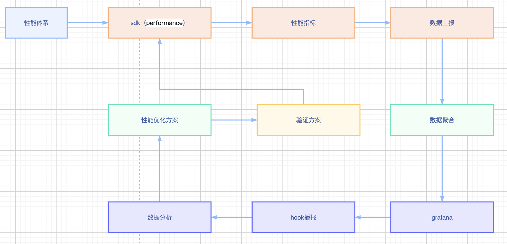

# 性能优化

> 做个很多次性能优化了，基本流程都差不多。核心思想就几句话：由主及次，由少到多；能存则存，能近则近。

## 常用策略

> 由服务端渲染代替单页面应用
> 主页内容成梯次呈现
> 使用cdn及服务器，浏览器缓存资源
> 压缩资源，拆分成小文件并发加载
> 兼容降级处理，如一些动画低端机不兼容，降级处理。

## 常用工具

### 上报信息

> 使用浏览器性能API-performance统计性能指标和网络指标并上报
> 使用埋点sdk上报流程执行时间

### 统计展示

> 使用`grafana`平台
> 自定义系统查看指标情况

### 优化分析建议

> 使用浏览器自带devtool工具
> 使用lighthouse工具分析
> 使用webpack工具分析包文件

性能优化是一个复杂问题，实践优化远不止这些策略和技巧。主要看目标和需求，需要实践的优化页的资源情况而定。

