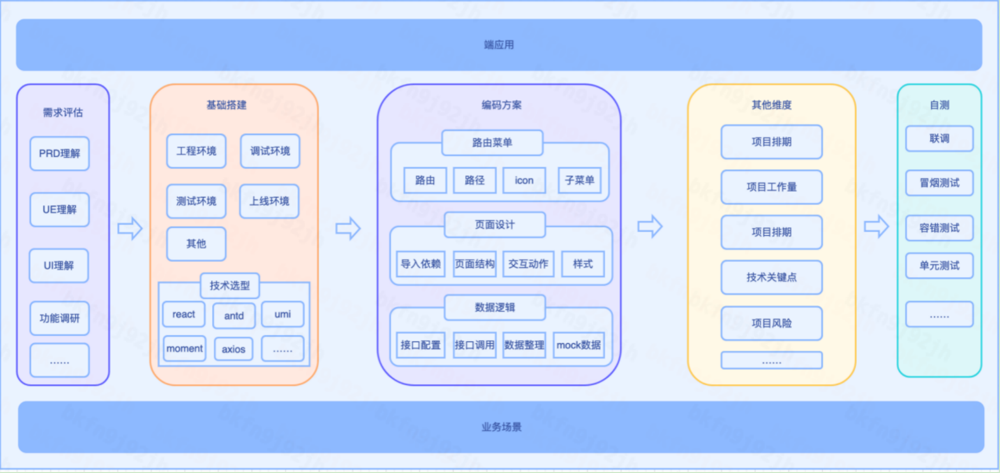
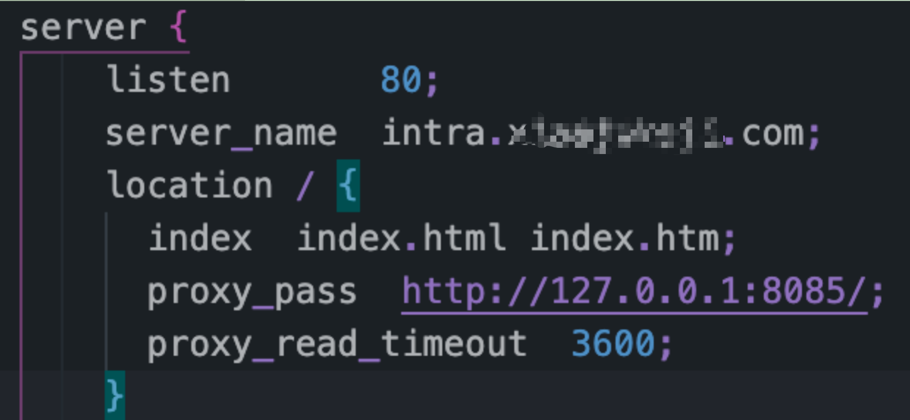

# 技术方案参考指南

- 每次项目评审之后，研发都会做一个技术方案，对于这个方案，大致可以参考如何模板来做。


## 端应用
 - 这个项目将来运行环境有哪些？如pc端、公众号、小程序、客户端内嵌、手机浏览器、桌面浏览器等。

## 需求评估
1、prd理解，梳理prd中提供的业务流程、技术功能点及约束条件。与已有经验进行merge。
2、UE/UI理解，梳理UE/UI的流程、交互、布局及约束条件。与已有组件实现经验进行merge。
3、功能调研，prd及UE/UI部分未实现过的功能，调研可行性。

## 基础搭建
- 研发工程环境的基本配置

### 搭建工程环境
1、新建git仓库
2、脚手架配置

### 技术选型
1、应用框架：umi+react-hooks+antd+ts
2、扩展库：moment、echarts、loadsh、axios、storejs等

### 搭建调试环境 
1、配置host ，如：127.0.0.1 dev.xx.com
2、使用nginx做代理(常用命令有：nginx -t ,nginx -s reload ,nginx ,nginx -s stop)
3、根据接口文档mock数据

``` sh

```
### 搭建测试环境 
1、配置工程中构建发布脚本（xx.sh）
2、配置构建流程，配置eslint、lint、sonar、soucemap等代码质量检测模块，
3、配置发布环境，申请测试域名，申请测试服务容器，配置域名解析及服务代理。


## 编码方案 
1、路由菜单
- 路径、组件，子菜单、icon
2、页面结构设计
- 导入组件，页面结构，结构样式、交互动作
3、数据逻辑
- 接口配置，接口调用，数据优化，mock数据
4、存储设置
- 局部数据、全局数据
5、通信设置
- 组件通信、轮训、系统级通信等

## 技术关注点
- 有无需要调研的功能
- 有无逻辑复杂功能点
- 有无周期长的功能点
- 有无难理清楚逻辑的功能点
- 有无交互已出现兼容性的功能点

## 研发工程结构
1、工程结构图
2、技术实现流程图
3、技术资源配置图

## 项目工作量
- xx个系统，xx个页面，xx个交互功能点，xx个联动，xx个集成组件；xx个接口，xx个case。

## 项目排期 
1、开发周期： 5.23-6.2日 ，xx 人/天
2、联调周期：6.6-6.10日 
3、自测周期：6.11日，
4、测试周期：待定
5、上线时间：待定

## 项目风险
1、prd 缺陷外溢，需求变更
2、UI/UE 缺陷外溢，重新调整
3、接口文档缺陷外溢，改到频繁
4、交互及功能点评估缺陷外溢，有未想到的case
5、是否留有buffer
6、项目人力，时间、运行环境等因素外溢。

## 业务场景
1、业务流程图及涉及到的业务角色
2、项目使用方的用途

## 其他
1、无设计图，有草稿截图
2、线上环境暂时未搭建
3、服务设备配置情况等


