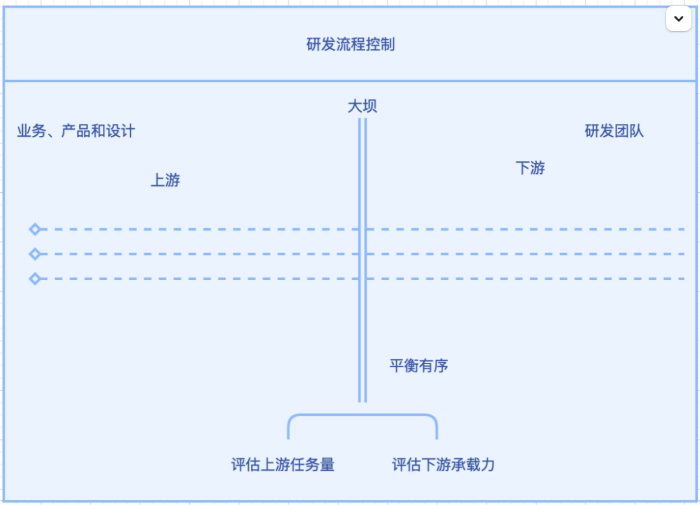

# 团队中的大坝

一个项目研发周期，需要很多专业角色的参与，如产品、设计、研发、测试等。每个团队一般都会配置owner或专家，来负责流程把关.

研发团队上游是业务、产品和设计，下游是研发团队。这道大坝是一个团队，有的是pmo+产品/研发/测试leader/owner,有的是只有pmo，取决于上游的复杂情况。

每一个团队都需要一个大坝一样的人，他的作用：

> 1、理事-把所有的事情理清楚
> 2、推动流程往下走 - 协调各方，解决堵塞，疏通渠道，让流程有条不紊的执行落地。

## 常见痛点

> 上游忽大忽小，夹砂带泥；下游一片狼藉。
> 1、上游任务量大，下游泛滥，
> 2、上游任务量小，下游干涸
> 3、上游泥沙大，下游淤积

## 大坝的作用

> 保护河道，平衡有序。拆解：
> 1、评估上游任务量，梳理上游节奏
> 2、评估下游承载量，梳理下游的承载能力
> 3、过滤水质，评估任务（任务可行性）

## pmo和研发leader、owner得不同

> 1、pmo对项目流程和交付负责，把控流程，单线，不具有技术专业性
> 2、研发leader/owner，对项目结果负责，评估人力和研发可行性，多线并发，具有技术的专业性

