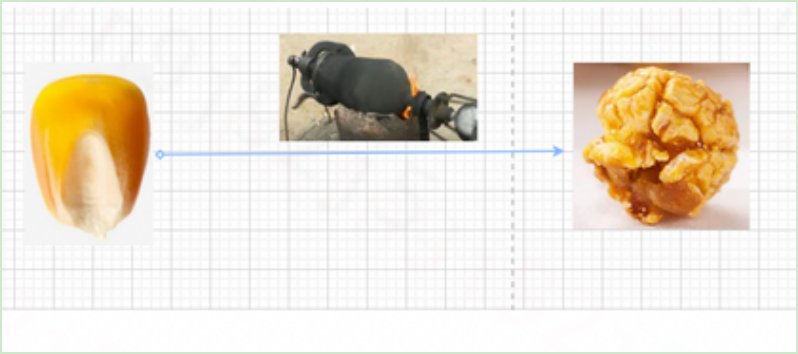
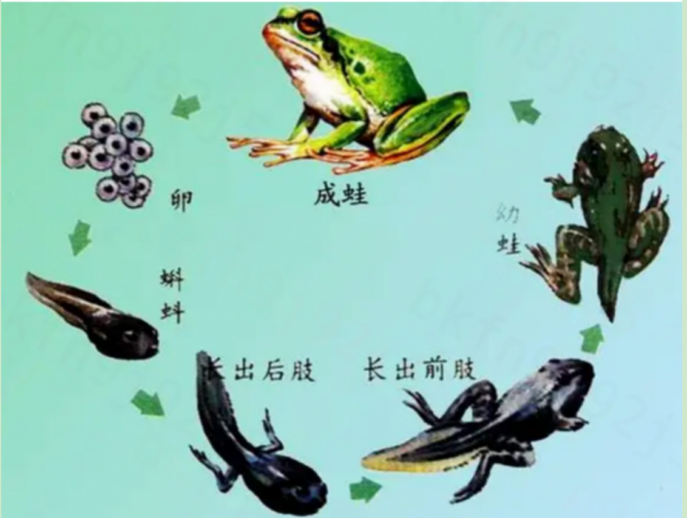
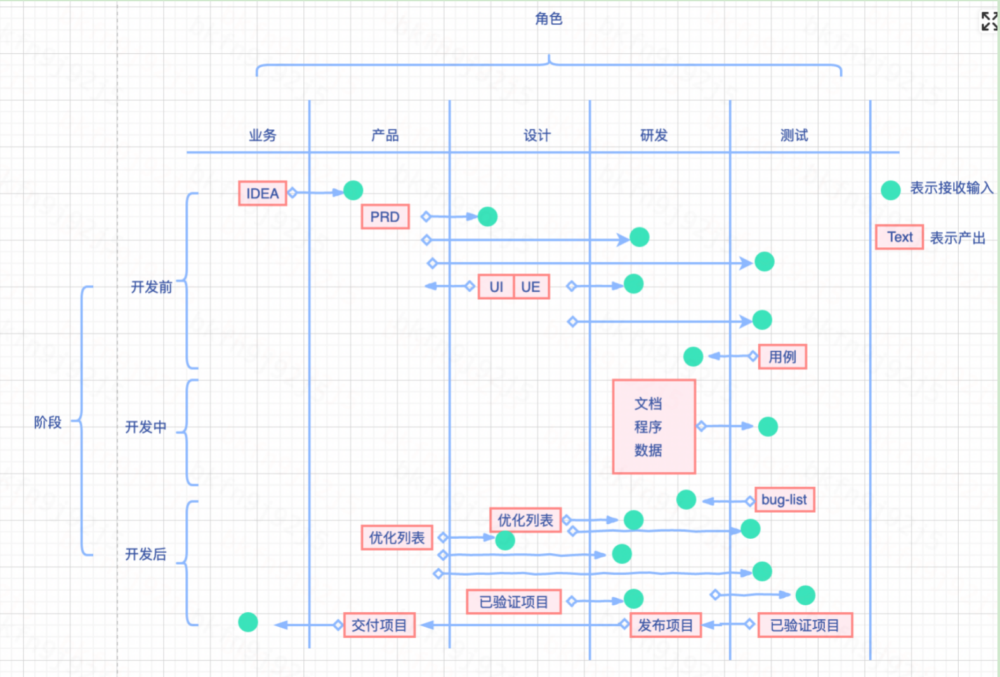
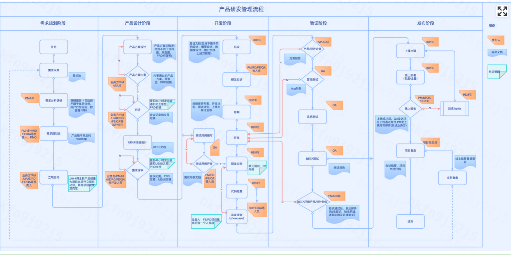
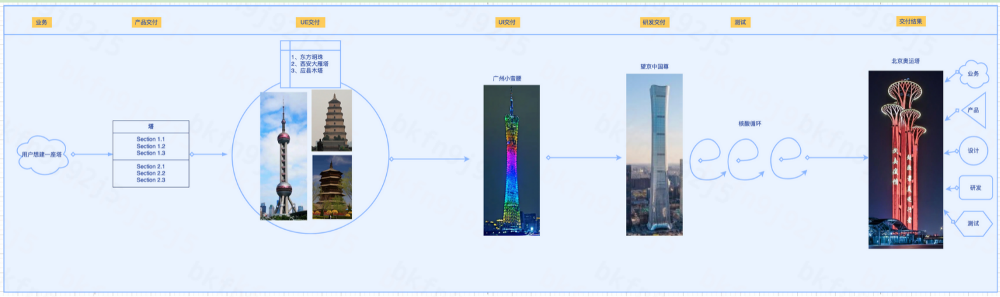
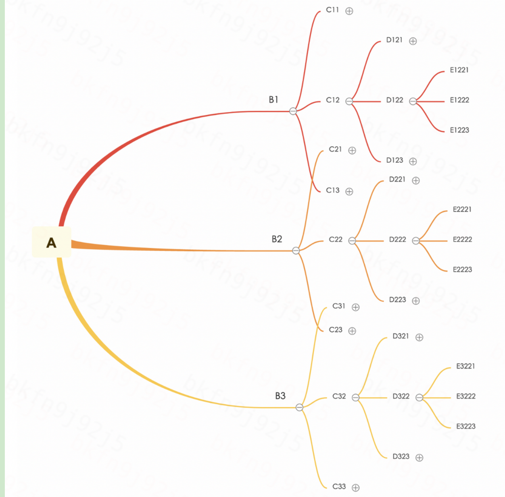
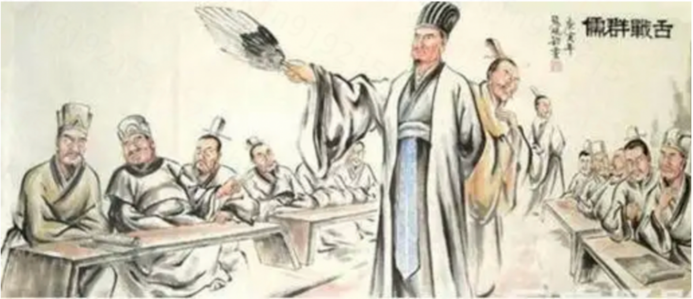
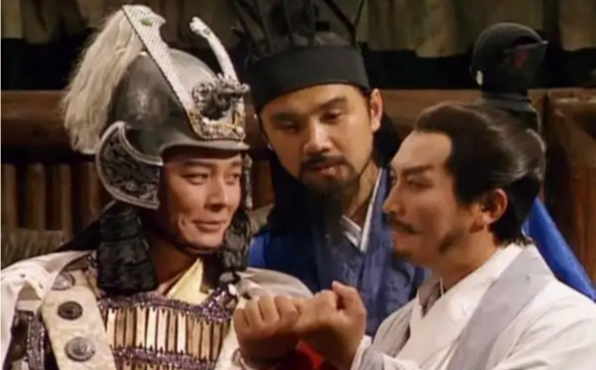
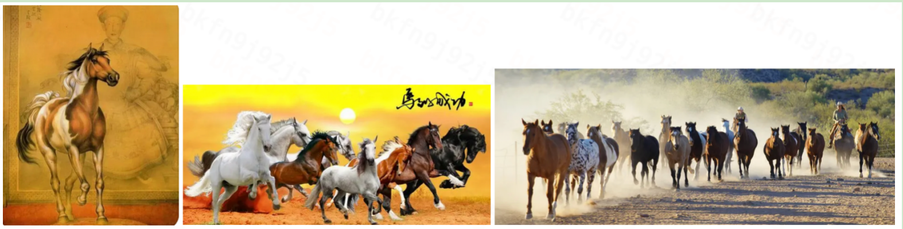
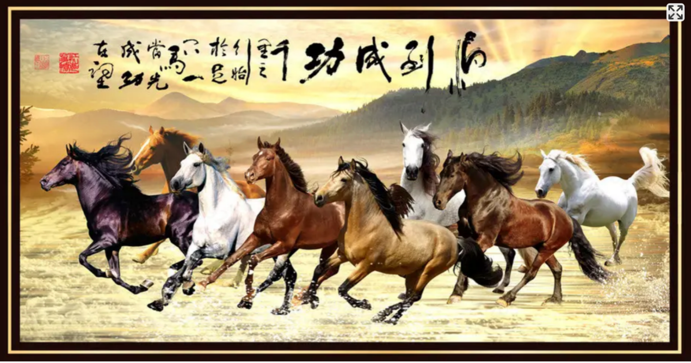

# 软件项目研发流程的思考

## 写在前边  
写本文的目的有二：  
1）打开思路，帮忙更多新团队融合并演化出适合自己的产品研发流程。  
2）帮忙团队各个角色归位，了解全局系统原理，摒弃偏见和心墙，成为真正的团队。   
## 迭代的方法论  
导语：迭代的方法论，参与的角色和阶段如下：  
主要角色：业务、产品、设计、研发、测试。   
核心阶段：开发前、开发中，开发后。  
## 基础项目研发流程  
先看下图：从图中观察，这个图每条边表示他们存在关系，粉色表示交付物。  
各个角色参与情况：  
业务：d(in)=1 ; d(out)=1，简单参与  
产品：d(in)=3 ; d(out)=6，中度参与  
设计：d(in)=2 ; d(out)=6，中度参与  
研发：d(in)=8 ; d(out)=3，深度参与  
测试：d(in)=6 ; d(out)=3，深度参与  
说明：  
1、流程主线：业务-产品-设计-研发-测试-设计/产品-业务。  
2、软件 = 程序+文档+数据  
3、重点关注研发过程。每个角色都很重要，都需要产出，环环相扣。大部分角色都是输出文档，从各个角度和方面在描述或验证一个事物，只有研发，是一个从玉米粒到爆米花的质变过程，在生产一个事物，时间/质量/成本要拿捏好，否则就前功尽弃了。  

‌
（拿捏好火候）  
也可能是这个过程（每个阶段不能少）：  
‌‌

流程图：  
‌

## 相对严格的项目研发流程  
本流程共5个阶段31个节点。（这个图是经过实践检验的流程）。这个流程每一步都有准入准出及交付物，环环相扣，形成闭环，符合精益制造的(S/P)DCA理论。  
‌‌

## 一个项目形成过程的举例  
1、每个人脑海中的理解都不同  
2、经历了一系列思维的碰撞  
3、最终的交付结果还是不错的  

这个图如何解释呢？   
业务：比较抽象的描述了用户的期望   
产品：详细描述了业务的期望   
UE/UI: 按照自己的理解，视觉上具象了产品的期望   
研发：按照自己的经验和理解，制造了自己对产品/设计产出的期望  
测试：按照自己的经验和理解，比较产品/设计/研发的交付物，拉齐各方得期望。  
结果：经过多轮的头脑风暴和迭代改进，这个需求越来越清晰，产出最终大家都认可得项目。  
说明：从业务-研发的过程，是从抽象到具体的过程。逐步把脑海中模糊的影像逐渐清晰呈现并制造出来的过程。  
‌‌

## 研发角度需要完成的流程  
8个核心环节（3个阶段：开发前123；开发中：45；开发后：678）：  
1、需求评审  
2、总体设计  
3、排期评估  
4、研发过程  
5、冒烟/单元测试  
6、构建发布  
7、维稳三板斧(监控配置/报警策略/值班机制)  
8、定期巡检  
详细解释：  
### 需求评审，研发需要输入什么？输出什么？  
1、业务查漏补缺，帮忙产品梳理业务逻辑、流程图，正流程和异常流程。  
2、技术可实现性，评估研发实现情况，难易程度（现有技术、现有工具等）  
3、研发人力情况，评估研发人力及研发时间  

### 总体设计，研发需要输入什么？输出什么？  
1、研发生产资料准备，包括设备、部署环境、域名等。  
2、研发生产工具准备，包括选型，采用的脚手架、组件库、研发工具链  
3、研发生产过程场景，包括所有流程、环节，正流程和异常流程。  

### 排期评估，研发需要输入什么？输出什么？  
1、评估有哪些页面、模块、交互点，与现有技能和组件库是否匹配？  
2、排除开会等已固定占用时间，评估接下来可投入的时间  
3、评估第三方合作和沟通环节。  
### 研发过程，研发需要输入什么？输出什么？  
1、具有代码整体设计的思路  
2、接口文档/库表设计  
3、UI/UE文档  
### 冒烟/单元测试  
1、质量工具检查代码  
2、核心功能case(p0)检查  
3、发布环境检查  
### 构建发布  
1、搭建项目发布部署(CI/CD)环境， 目前使用公司基础平台工具gitlab+oe+odin（3件套）完成  
2、将工程发布到服务器环境 ，oe提供cr、编译打包、sonar检查、发布cdn、构建到odin的流水线，odin提供服务容器及网络IP  
3、正常访问工程，目前使用麒麟/海姆作为接入层，提供dns服务，打通服务和工程。  
### 监控配置  
1、配置服务测监控，如cdn、服务器内存/CPU/网络报警策略，容量达到70%，90%等。  
2、配置稳定性监控，如代码报错、访问异常（不可访问）、性能异常（打开页面时长）、流量陡变（pv/uv）等。  
### 报警策略  
1、服务类指标，同比、环比异常预警  
2、自定义指标，超出预期值  
3、报警等级设定  
### 值班机制  
1、配置值班im群，值班列表，值班周期、值班职责、清零周期、定期汇总、反馈机制、处理流程、处理方案。  
2、配置通知方式，如IM、邮件、短信、电话  
### 定期巡检  
1、逐渐迭代，导致系统复杂度增加，需要定期盘点并整理。如衣柜一直新增衣服，时间久了会一团乱。  
2、用户变化或时间迁移，导致系统整体老化或操控不好，需要定期重构。如手机，定时清理或升级系统。  
### 常见问题  
1、需求评审和UI/UE不充分，导致开发中，产品、设计和研发之间投入调整的次数非常多。  
2、冒烟测试不充分，导致研发和测试之间投入调整的次数非常多。  
3、研发评估不充分，导致加班赶进度。  

## 过程解剖  
###  点线面体论  
1、研发流程，从业务-研发上线过程，是一个从点-线-面-体的过程，从云端往下看，整个过程是逐步发散，场景越来越复杂。到用户这层，无法控制了，你想不到的场景太多太多了。  
如图：A-产品PRD ,B-设计UE/UI , C-研发功能点, D-测试CASE, E-用户使用场景。成指数级增长。以登录为例。如何让它可收敛，可执行呢？如图，10字真言：抓主干，剪小枝，递进拓展。  
‌‌

A-产品prd-概括性的主流程（概括）  
B-设计UI/UE-概括性的展示场景（延展）  
C-研发-能想到的动态交互场景（细节）  
D-测试-时间段内能检查的用户场景（更细节），如电商有10个品类，每个10个子项，要全部覆盖需要10的10次次执行，每次执行1毫秒，大约10**10毫秒，百亿毫秒，19年。京东上远不止这些。  
E-用户-符合我使用习惯的场景（无限细节）。大千世界无奇不有。我在田地里，我在飞机上，我在厕所里，我在……  

所以，逆向的变更（需求变更），是可怕的。  
变更  
变更（业务、产品、设计）->要不要支持？需要新增流程，召集各方评审影响面（站在项目全局角度评估影响）  

如何产出高质量的项目呢？ 相信人类的智慧，给普通人武装灵敏抗打击的智能装甲就OK了  
属于研发的灵敏、抗打击、智能的装甲是什么呢? 灵敏装甲：小巧的工具，作用大而限制小，如IDE，vscode，脚手架；  
抗打击装甲：系统鲁棒性的保障工具，如eslint、sonar、cr等  
智能的装甲：系统自我识别及修复的工具，如监控、自动扩容、自动重启、值班、预警等。  

有了这些工具并逐渐丰富，研发在应对需求变更，产出高质量项目上都有了不少信心。  

应对变更需要一些策略，如：降物论（一物降一物）：打击一个人，狙击枪；打击一群人，加特林，打击很远的建筑物，用导弹。  
人类擅长的是思考，制定流程，使用工具（善假于物也），多引入或发明工具，做到好钢用到刀刃上，提升项目的敏捷度。  

每次需求变更，就引来不少争议，如何解决？需要新增一个角色来推进，统一大家的言行和目标。  
pmo（纵横家，有纵横捭阖之才）不容易，要把各类角色（业务，产品、设计、研发、测试）的矛盾化解，放弃小我，成就大我，并团结起来从一个方向（项目上线）努力（合纵连横，一致对外）。跟踪研发每一个阶段，每一次会议的共识，向拔河一样，保持一致节奏，一起赢得比赛。  
‌‌

遇到需求变更，一般弄情绪最凶的都是研发（战士，为什么呢？好比高考的作文，老师就给100个字的描述，然后让你写800字以上，还限定了时间，还要精彩，还不一定给高分，能不气吗？），研发环节是项目的最核心的‘限制步骤’，发生质变的过程，所以一般pmo都得配一个技术owner（大将军）来协助，帮忙安抚并提供可行性方案来引导研发顺利进行。  
‌‌

## 研发模式分类  
常见的研发模式有如下几种：  
场景1，业务+外采  
场景2，mvp项目-研发   
场景3，产品+研发   
场景4，产品+设计+研发+测试  
场景5，业务+产品+设计+研发+测试    

## 常见问题  
1、prd没有规范，描述的不清楚，有歧义。  
2、UE/UI太过艺术，缺少一些特定场景的展示图  
3、研发觉得产品/设计提供的文档缺少很多内容  

最后，举个 八骏图的例子，说明敏捷开发的过程。  

业务：需要一副八骏图  
产品：1,一幅图; 2,有8匹马在水里跑; 3,他们跑的状态不同  
设计：（踏在花丛中，有夕阳有大鸟，就一个字：美）   
‌‌

研发：（水中奔跑,精神饱满）   
‌‌

测试：（每一匹马的形态，八匹马得形态，一群马的形态,范围全面）   
‌‌
‌‌

经过多次磋商（思维交锋），最终交付：（有字、有印、踏水、有夕阳、形态不同的八匹马）    
‌‌

## 总结  
上边的所有示例可以看出，产品/设计文档没有研发团队期望的面面俱到，研发的软件也没有产品/设计团队要的高保真还原。大部分团队也是这样的现状。那这样我们就灰心了吗？不，我们的目标不是这些，而是优秀的软件项目。 项目结果好了，这个过程才会刻骨铭心，团队才有荣誉！诸如乔布斯对苹果产品得千锤百炼，国师张艺谋对东奥闭幕式节目得千挑万选。都是一样的逻辑：最初只有模糊的影像，对好产品/节目得期望；随着研发一步步实现，产品定义逐渐清晰，逐渐工匠式得打磨，最后打造出令人拍手叫绝的产品。 他们每个人不是全球顶级专家，但他们的团队是全球最好的团队。   
## 写在最后  
当然，实际问题远不止这些复杂，不是几句话就能说明白的。同样是葡萄，有的说好吃，有的说酸。项目研发过程有很多不确定性，这套理论是否能够落地，还是要看团队磨合程度了。   
通过上述的启发，期望大家能够找出一个适合团队的最佳迭代流程。    
水平有限，如果对您有启发，动动小手点点赞，欢迎批评指正！谢谢阅读    

